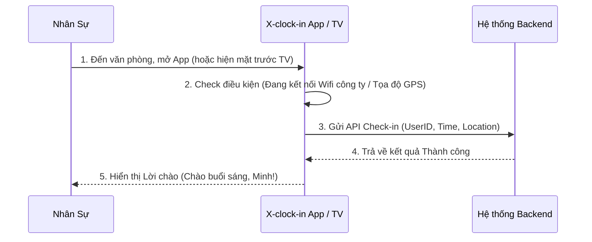

# FRS: X-clock-in (Hệ Thống Chấm Công Nội Bộ)
**Trạng thái:** Draft (v1.0)
**Người viết:** MinhCQ (PM)
**Deadline Go-live:** 05/06/2026
**Tài nguyên:** 1 Fullstack Dev (Dev 3)

---

## 1. Ngữ cảnh & Giá trị (Context & Value)
- **JTBD:** Nhân sự cần ghi nhận giờ đến công ty và giờ về một cách nhanh chóng.
- **Pain:** Hiện tại đang dùng máy chấm công vân tay cũ / excel thủ công, hay bị lỗi, HR tốn thời gian tổng hợp cuối tháng.
- **Gain:** Chấm công nhanh (chỉ cần quẹt Wifi hoặc quét QR/Khuôn mặt trên Smart TV). HR có ngay Dashboard xem số liệu tự động.
- **Goal (MVP):** Làm luồng cơ bản nhất chạy mượt mà trước ngày 5/6. Mọi tính năng rườm rà (tính lương, nghỉ phép phức tạp) sẽ bị đẩy sang Phase 2.

---

## 2. Quy trình & Luồng nghiệp vụ (Business Flow)

---

## 3. Đặc tả Tính năng (Functional Requirements - MVP)

### Feature 1: Check-in / Check-out cơ bản
- **User Story:** As an [Employee], I want to [bấm nút check-in trên điện thoại khi đến văn phòng] so that [hệ thống ghi nhận giờ làm của tôi].
- **Acceptance Criteria:**
  - **Given** user đang kết nối với Wifi nội bộ của công ty (SSID: CASSO_CORP).
  - **When** user bấm nút "Check In" trên giao diện.
  - **Then** hệ thống ghi nhận thời gian hiện tại vào Database và đổi trạng thái màn hình thành "Đã Check-in".

### Feature 2: Dashboard cho HR/Admin
- **User Story:** As an [Admin], I want to [xem danh sách chấm công trong ngày] so that [tôi biết ai đi muộn, ai đi sớm].
- **Acceptance Criteria:**
  - **Given** Admin đăng nhập vào trang Web quản trị.
  - **When** chọn xem dữ liệu của ngày hôm nay.
  - **Then** hiển thị danh sách dạng bảng (Tên, Giờ Đến, Giờ Về, Trạng thái Đi Muộn).

---

## 4. Đặc tả Dữ liệu (Models - Draft)
- Bảng `users`: `id`, `name`, `role`
- Bảng `attendance_logs`: 
  - `id`
  - `user_id` (Khóa ngoại)
  - `date` (Ngày)
  - `check_in_time` (Datetime)
  - `check_out_time` (Datetime)
  - `status` (Đúng giờ, Đi muộn, Về sớm)

---

## 5. Nằm ngoài phạm vi (Out of Scope - CẤM DEV LÀM)
*Để đảm bảo kịp deadline 5/6, các tính năng sau bị cắt khỏi Phase 1:*
- KHÔNG làm logic duyệt đơn xin nghỉ phép (Leave Request). Vẫn dùng form giấy hoặc Google Form tạm thời.
- KHÔNG làm logic tính tiền lương tự động (Payroll). Chỉ xuất file Excel tổng giờ làm cho HR.
- KHÔNG làm nhận diện khuôn mặt AI phức tạp nếu Dev chưa có kinh nghiệm. Ưu tiên bấm nút trên điện thoại + check Wifi trước.
