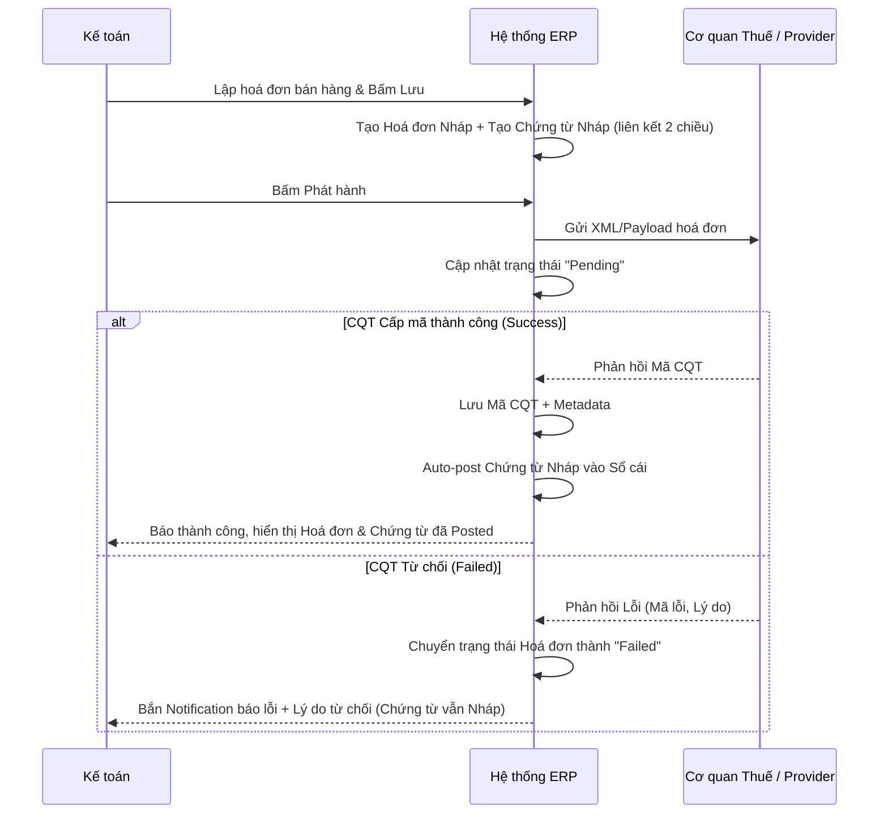

# FRS: F1 - MST Autofill & Xuất hoá đơn điện tử đầu ra

## 1. Thông tin chung (General Information)
**Mục đích (Purpose):** 
Tính năng này giúp Kế toán viên giảm thời gian và rủi ro sai sót khi nhập liệu thông tin đối tác bằng cách tự động điền dữ liệu dựa trên Mã số thuế (MST). Đồng thời, phù hợp với thói quen kế toán là lập hoá đơn bán hàng và lập chứng từ cùng lúc, nhưng chỉ tự động vào sổ (auto-post) khi Cơ quan Thuế cấp mã hoá đơn thành công. Nếu CQT từ chối, hệ thống sẽ cảnh báo để người dùng xử lý.

**Phạm vi (Scope):**
- **In-scope:** 
  - Gọi API tra cứu thông tin MST từ CQT và tự động điền (Auto-fill).
  - Tạo hoá đơn đầu ra và tạo chứng từ nháp (Draft Journal Entry) đồng thời.
  - Gửi dữ liệu hoá đơn (XML/Payload theo NĐ 70/2025) lên cổng thuế/provider.
  - Xử lý trạng thái trả về (Cấp mã hoặc Từ chối).
  - Tự động hạch toán (Auto-post) chứng từ vào sổ cái khi hoá đơn được cấp mã.
- **Out of scope:** 
  - Đăng ký sử dụng HĐĐT lần đầu với CQT (Message 100).
  - Quản lý phê duyệt nhiều cấp (Multi-level approval phức tạp).
  - Tích hợp ký số HSM/token USB nâng cao (chuyển sang Phase 2).

**Thuật ngữ (Glossary):**
- **CQT:** Cơ quan Thuế.
- **MST:** Mã số thuế.
- **HĐĐT:** Hoá đơn điện tử.
- **Chứng từ nháp (Draft Entry):** Bút toán kế toán được tạo ra nhưng chưa ghi sổ cái, chờ kết quả xác nhận hợp lệ từ CQT.
- **Auto-post:** Tự động chuyển chứng từ từ trạng thái Nháp sang Đã Ghi Sổ (Posted) vào sổ cái.

---

## 2. Mô tả chức năng chi tiết (Functional Requirements)

### F1.1 Tra cứu MST & Tự động điền (Auto-fill)
- **Mô tả:** Nhập MST vào form và hệ thống tự động trả về thông tin doanh nghiệp.
- **Tác nhân:** Kế toán viên.
- **Hậu điều kiện:** Dữ liệu Tên, Địa chỉ, Trạng thái hoạt động được điền tự động.

### F1.2 Tạo hoá đơn đầu ra + Tạo chứng từ nháp đồng thời
- **Mô tả:** Khi người dùng tạo hoá đơn bán hàng, hệ thống đồng thời tạo một chứng từ nháp (journal entry draft) và liên kết hai chiều giữa Hoá đơn và Chứng từ.
- **Tác nhân:** Kế toán viên / Kế toán trưởng.
- **Hậu điều kiện:** Một hoá đơn nháp và một chứng từ nháp được tạo và liên kết, chưa ghi sổ.

### F1.3 Phát hành hoá đơn lên CQT & Tự động vào sổ
- **Mô tả:** Gửi XML/payload lên CQT. Nếu nhận "Success/Cấp mã", tự động post chứng từ nháp vào sổ cái. Nếu "Failed", bắn Notification.
- **Tác nhân:** Hệ thống / Kế toán viên.
- **Hậu điều kiện:** Chứng từ được vào sổ cái (nếu Success), hoặc bắn thông báo lỗi (nếu Failed).

---

## 3. Kịch bản nghiệp vụ (Use Cases & Flows)

### UC-F1-01: Tạo hoá đơn đầu ra và tạo chứng từ nháp đồng thời
- **Mục tiêu:** Khi kế toán tạo hoá đơn bán hàng, hệ thống tự tạo chứng từ nháp và liên kết dữ liệu.
- **Luồng chính:**
  1. Người dùng nhập thông tin hoá đơn (khách hàng, dòng hàng, thuế suất, tổng tiền…).
  2. Người dùng bấm “Lưu” hoặc “Lưu & phát hành”.
  3. Hệ thống tạo **Hoá đơn** ở trạng thái nháp (Draft/Pending) và tạo **Chứng từ nháp** tương ứng.
  4. Hệ thống liên kết 2 chiều: Hoá đơn ↔ Chứng từ nháp.
  5. Chứng từ nháp **không post** vào sổ cái tại thời điểm này.
- **Luồng ngoại lệ:** Thiếu dữ liệu bắt buộc (MST, địa chỉ, thuế suất) → chặn lưu và hiển thị lỗi.

### UC-F1-02: Phát hành hoá đơn lên thuế, nhận trạng thái và tự động vào sổ
- **Mục tiêu:** Đồng bộ trạng thái phát hành; chỉ post sổ cái khi CQT cấp mã.
- **Luồng chính:**
  1. Hệ thống gửi request phát hành hoá đơn lên Cơ quan Thuế/provider.
  2. Hệ thống cập nhật trạng thái phát hành (Pending/Processing).
  3. Khi nhận kết quả **Success/Cấp mã**: lưu mã CQT + metadata và **tự động post** chứng từ nháp thành Accounting Entry trong sổ cái.
  4. Khi nhận kết quả **Failed**: chuyển trạng thái Failed và **bắn Notification** cho kế toán kèm lý do.
- **Luồng ngoại lệ:** Timeout/không nhận callback → giữ trạng thái Pending, cho phép retry/tra soát.

### UC-F1-03: Tra cứu MST
- **Luồng chính:** Nhập MST -> Call API -> Điền Tên công ty, địa chỉ. Báo lỗi nếu sai định dạng hoặc MST không tồn tại.

---

## 4. Tiêu chí nghiệm thu (Acceptance Criteria - AC)

```gherkin
Scenario: Lập hoá đơn và chứng từ nháp đồng thời
    Given Kế toán nhập đủ thông tin hoá đơn bán hàng
    When Kế toán bấm "Lưu"
    Then Hệ thống tạo 1 Hoá đơn Nháp và 1 Chứng từ Nháp
    And Hai thực thể được liên kết với nhau
    And Chứng từ Nháp chưa được post vào sổ cái

Scenario: Phát hành hoá đơn và Auto-post thành công
    Given Có 1 hoá đơn nháp và chứng từ nháp đã liên kết
    When Kế toán bấm "Phát hành" và CQT trả về kết quả "Cấp mã thành công"
    Then Mã CQT được lưu vào hệ thống
    And Trạng thái chứng từ tự động chuyển thành "Đã hạch toán (Posted)" trong sổ cái

Scenario: CQT từ chối cấp mã hoá đơn
    Given Kế toán gửi phát hành hoá đơn
    When CQT trả về kết quả "Từ chối / Lỗi"
    Then Trạng thái chứng từ vẫn giữ nguyên là "Nháp"
    And Hệ thống bắn Notification màu đỏ chứa nội dung lỗi chi tiết để kế toán xử lý
```

---

## 5. Luồng công việc & Sơ đồ (Workflows & Diagrams)



---

## 6. Quy tắc nghiệp vụ (Business Rules)
- **BR-1:** Không tự động post chứng từ vào sổ cái khi CQT chưa trả về kết quả Cấp mã thành công.
- **BR-2:** Thông tin Đối tác, Thuế suất, Tổng tiền trên Hoá đơn và Chứng từ Nháp phải khớp hoàn toàn.
- **BR-3:** Nếu MST bị huỷ hoặc doanh nghiệp ngừng hoạt động, chặn phát hành hoá đơn.

---

## 7. Giao diện người dùng (UI/UX Requirements)
- Màn hình lập hoá đơn có tuỳ chọn hiển thị (hoặc liên kết nhanh tới) Chứng từ nháp tương ứng.
- Notification realtime (chuông/toast) khi nhận kết quả Failed từ CQT, cho phép click vào notification để mở trực tiếp hoá đơn bị lỗi.
- MST Autofill có icon Checkmark khi tra cứu thành công.

---

## 8. Yêu cầu về dữ liệu (Data Requirements)
- **Data Mapping:**
  - Hoá đơn lưu trường `cqt_code` (Mã cơ quan thuế).
  - Hoá đơn lưu `linked_journal_entry_id` trỏ đến Chứng từ kế toán.
- **Validation:** Bắt buộc nhập MST hợp lệ trước khi bấm Lưu/Phát hành.

---

## 9. Yêu cầu phi chức năng (Non-functional Requirements - NFR)
- Xử lý bất đồng bộ (Webhook/Polling) khi chờ CQT cấp mã để không block UI của người dùng.
