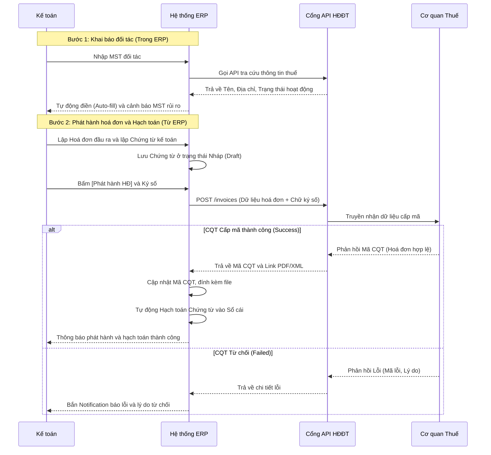

# FRS: F1 - Tra cứu MST & Phát hành Hoá đơn điện tử

## 1. Thông vị chung (General Information)
**Mục đích (Purpose):** 
Tính năng này giúp Kế toán viên giảm thời gian và rủi ro sai sót khi nhập liệu thông tin đối tác bằng cách tự động điền dữ liệu dựa trên Mã số thuế (MST). Đồng thời, tự động hóa quy trình phát hành hoá đơn điện tử trực tiếp lên Cơ quan Thuế (CQT) thông qua cổng API HĐĐT (X-Invoice), thay thế thao tác nộp tờ khai thủ công.

**Phạm vi (Scope):**
- **In-scope:** 
  - Gọi API tra cứu thông tin MST từ CQT.
  - Tự động điền (Auto-fill) thông tin đối tác vào ERP.
  - Hỗ trợ ký số (USB Token / Cloud HSM).
  - Gửi dữ liệu hoá đơn (Thông điệp 200) sang API HĐĐT.
  - Xử lý phản hồi từ CQT (Cấp mã hoặc Từ chối).
  - Tự động hạch toán (Auto-post) chứng từ khi hoá đơn được cấp mã thành công.
- **Out of scope:** 
  - Đăng ký sử dụng HĐĐT lần đầu với CQT (Message 100) - thực hiện ngoài ERP.
  - Quản lý và lập báo cáo tổng hợp tình hình sử dụng hoá đơn (thuộc phân hệ khác).

**Thuật ngữ (Glossary):**
- **CQT:** Cơ quan Thuế.
- **MST:** Mã số thuế.
- **HĐĐT:** Hoá đơn điện tử.
- **CKS:** Chữ ký số.
- **Chứng từ nháp (Draft Entry):** Bút toán kế toán được tạo ra nhưng chưa ghi sổ cái, chờ kết quả xác nhận hợp lệ từ CQT.
- **Auto-post:** Hành động tự động chuyển trạng thái chứng từ từ Nháp sang Đã Ghi Sổ (Posted).

---

## 2. Mô tả chức năng chi tiết (Functional Requirements)

### F1.1 Tra cứu MST & Tự động điền (Auto-fill)
- **Mô tả:** Nhập MST vào form và hệ thống tự động trả về thông tin doanh nghiệp hợp lệ.
- **Tác nhân (Actors):** Kế toán viên.
- **Tiền điều kiện:** Người dùng có quyền truy cập module Đối tác (Partner) hoặc form Lập hoá đơn.
- **Hậu điều kiện:** Dữ liệu Tên, Địa chỉ, Trạng thái hoạt động được điền tự động.

### F1.2 Phát hành hoá đơn điện tử trực tiếp
- **Mô tả:** Ký số hoá đơn và gửi yêu cầu cấp mã lên CQT thông qua API.
- **Tác nhân:** Kế toán viên.
- **Tiền điều kiện:** Đối tác có MST hợp lệ, chứng từ bán hàng có đủ thông tin hàng hoá, thuế suất. Đã kết nối CKS.
- **Hậu điều kiện:** Hoá đơn nhận được Mã CQT và Link PDF; Chứng từ nháp được hạch toán tự động (Auto-post) vào sổ cái.

---

## 3. Kịch bản nghiệp vụ (Use Cases & Flows)

### UC-F1-01: Tra cứu MST
- **Luồng chính (Happy Path):**
  1. Kế toán nhập MST (10 hoặc 13 số) vào field "Mã số thuế".
  2. Bấm "Tra cứu" hoặc rời focus khỏi field.
  3. Hệ thống gọi API tra cứu MST.
  4. Hệ thống tự động điền: Tên Công ty, Địa chỉ, Tên người đại diện. Gắn nhãn "Đã xác thực".
- **Luồng ngoại lệ (Exception Flows):**
  - **MST sai định dạng:** Hệ thống báo lỗi đỏ ngay tại field, không gọi API.
  - **MST không tồn tại / Đã giải thể:** Hệ thống hiển thị Banner cảnh báo màu đỏ, khoá tính năng phát hành hoá đơn đối với MST này.

### UC-F1-02: Phát hành hoá đơn và Hạch toán
- **Luồng chính (Happy Path):**
  1. Kế toán lập Chứng từ Bán hàng và Hoá đơn đầu ra tương ứng.
  2. Hệ thống lưu chứng từ ở trạng thái **Nháp (Draft)**.
  3. Kế toán bấm [Phát hành HĐ] và thực hiện Ký số.
  4. Hệ thống gửi Payload (XML data + Chữ ký) sang API HĐĐT.
  5. CQT tiếp nhận và trả về "Cấp mã thành công".
  6. Hệ thống tự động: Lưu Mã CQT, đính kèm file PDF/XML, và **Auto-post** chứng từ Nháp vào sổ cái.
- **Luồng ngoại lệ (Exception Flows):**
  - **CQT từ chối cấp mã (Failed):** Hệ thống bắn Notification (chuông/toast) báo chi tiết lỗi (vd: MST người mua sai, tổng tiền lệch). Chứng từ giữ nguyên trạng thái **Nháp**. Kế toán sửa dữ liệu và bấm Phát hành lại.

---

## 4. Tiêu chí nghiệm thu (Acceptance Criteria - AC)

```gherkin
Scenario: Tra cứu MST thành công
    Given Kế toán đang ở màn hình tạo Đối tác
    When Kế toán nhập MST "0316794479" và bấm Tra cứu
    Then Hệ thống điền chính xác Tên "CÔNG TY TNHH CASSO"
    And Field địa chỉ được điền đầy đủ
    And Không cho phép sửa tay các thông tin đã được xác thực từ CQT trừ khi tắt cờ "Xác thực"

Scenario: Phát hành hoá đơn và Auto-post thành công
    Given Có 1 chứng từ bán hàng ở trạng thái Nháp đã điền đủ thông tin
    When Kế toán chọn "Phát hành" và ký số hợp lệ
    Then Hệ thống gửi data qua API trong < 3 giây
    And Nhận về Mã CQT
    And Trạng thái chứng từ tự động chuyển thành "Đã hạch toán (Posted)"
    And File PDF được đính kèm vào tab Tài liệu của chứng từ

Scenario: CQT từ chối cấp mã hoá đơn
    Given Kế toán gửi phát hành hoá đơn bị sai thông tin (ví dụ: sai thuế suất)
    When Hệ thống nhận phản hồi lỗi từ CQT
    Then Trạng thái chứng từ vẫn là "Nháp"
    And Hiển thị Notification màu đỏ chứa nội dung lỗi chi tiết từ CQT
```

---

## 5. Luồng công việc & Sơ đồ (Workflows & Diagrams)



---

## 6. Quy tắc nghiệp vụ (Business Rules)
- **BR-1:** Không được phép phát hành hoá đơn nếu MST của đối tác có trạng thái "Đã giải thể" hoặc "Tạm ngừng kinh doanh".
- **BR-2:** Hoá đơn đã được Cấp mã CQT thì không được phép chỉnh sửa nội dung trong ERP (Chỉ hỗ trợ làm hoá đơn Điều chỉnh/Thay thế ở phân hệ khác).
- **BR-3:** Auto-post chỉ được kích hoạt khi và chỉ khi CQT trả về trạng thái "Cấp mã thành công" và tổng Nợ/Có của chứng từ cân bằng.

---

## 7. Giao diện người dùng (UI/UX Requirements)
- **Giao diện Tra cứu MST:** 
  - Nút [Tra cứu] nằm cạnh Input MST. Có loading spinner khi đang call API.
  - Nếu thành công: Hiển thị icon Checkmark xanh lá "Đã xác thực".
- **Banner cảnh báo:** Nếu MST rủi ro, hiện Banner đỏ nổi bật trên cùng trang tạo Chứng từ/Đối tác.
- **Giao diện Phát hành:** Nút [Phát hành Hoá Đơn] bị disable nếu thông tin bắt buộc bị thiếu. Khi click, mở popup xác nhận chọn Chữ ký số.
- **Trạng thái Chứng từ:** Thêm cột "Mã CQT" trên Grid danh sách. Các chứng từ bị từ chối sẽ có badge "Lỗi phát hành" màu đỏ.

---

## 8. Yêu cầu về dữ liệu (Data Requirements)
- **Data Mapping:**
  - `taxCode` -> `partner.vat`
  - `companyName` -> `partner.name`
  - `address` -> `partner.street`
  - `cqtCode` -> `invoice.cqt_code` (Lưu dưới dạng chuỗi 23 ký tự, ví dụ: `...C26...`)
- **Data Validation:** 
  - MST phải có độ dài đúng 10 hoặc 13 số.
  - Tổng tiền trước thuế + Tiền thuế phải bằng Tổng tiền thanh toán (Validate trước khi gửi API).

---

## 9. Yêu cầu phi chức năng (Non-functional Requirements - NFR)
- **Bảo mật:** Dữ liệu chữ ký số không được lưu cache trên client. Chuỗi Private Key của HSM phải được mã hoá.
- **Hiệu năng:** API tra cứu MST phải phản hồi trong < 3 giây. API nhận mã CQT phản hồi tuỳ thuộc vào Thuế nhưng ERP không được block UI (dùng cơ chế Async/Polling nếu cần).
