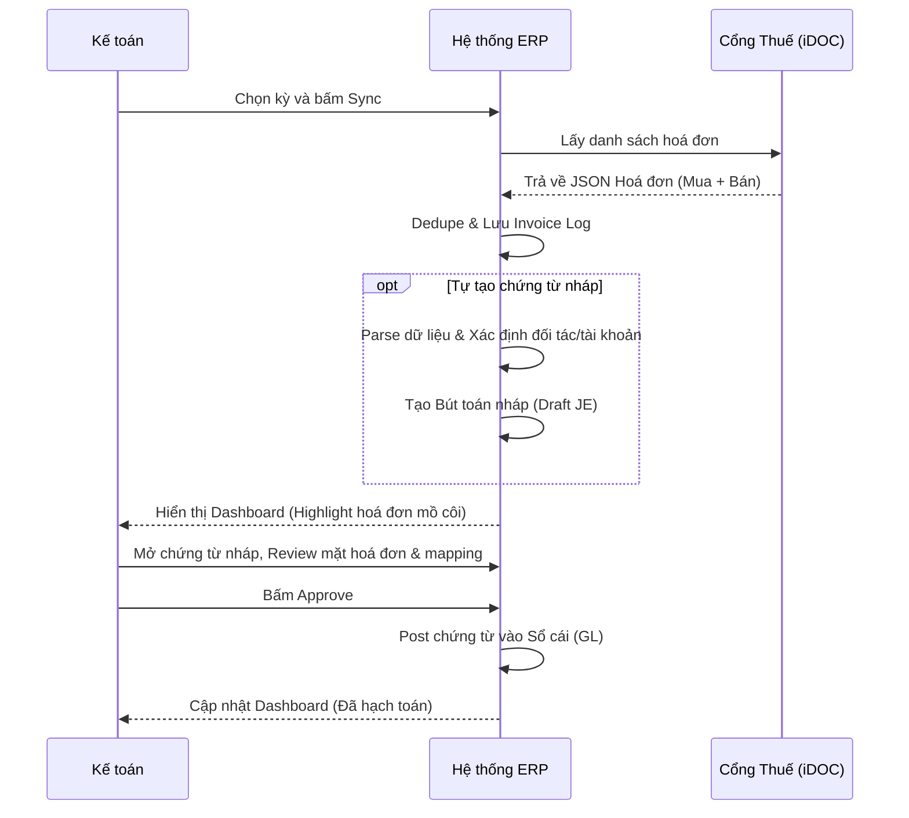

# FRS: F2 - Kéo Hoá Đơn Điện Tử Từ Cơ Quan Thuế

## 1. Thông tin chung (General Information)
**Mục đích (Purpose):** 
Xoá bỏ bước thủ công kéo hoá đơn từ portal Tổng cục Thuế (iDOC/GDT) rồi nhập lại vào ERP. Tính năng này cho phép đồng bộ hoá đơn đầu vào/ra, tự động tạo chứng từ nháp, hỗ trợ workflow phê duyệt và cung cấp Dashboard đối soát tình trạng hạch toán của hoá đơn.

**Phạm vi (Scope):**
- **In-scope:** 
  - Kết nối cổng thuế (iDOC) để kéo danh sách hoá đơn mua vào/bán ra theo kỳ.
  - Tự động sinh draft journal entry (Nợ/Có theo TT99) cho mỗi hoá đơn.
  - Workflow phê duyệt chứng từ: Kế toán review -> Approve -> Vào sổ cái.
  - Dashboard theo dõi trạng thái hoá đơn, highlight cảnh báo hoá đơn chưa map chứng từ.
- **Out of scope:** 
  - Huỷ/điều chỉnh hoá đơn (Phase 2).
  - Tích hợp chữ ký số HSM (Phase 2).

**Thuật ngữ (Glossary):**
- **GDT/iDOC:** Cổng dữ liệu hoá đơn điện tử của Tổng cục Thuế.
- **Chứng từ nháp (Draft Entry):** Bút toán được hệ thống tự sinh từ hoá đơn, chờ Kế toán duyệt.
- **Mapping:** Sự liên kết 2 chiều giữa một Hoá đơn điện tử và một Bút toán/Chứng từ kế toán.

---

## 2. Mô tả chức năng chi tiết (Functional Requirements)

### F2.1 Kết nối cổng thuế & Đồng bộ hoá đơn
- **Mô tả:** Gọi API iDOC lấy danh sách hoá đơn theo kỳ. Dedupe dữ liệu.
- **Tác nhân:** Kế toán viên.

### F2.2 Tự động tạo chứng từ nháp & Gợi ý mapping
- **Mô tả:** Từ hoá đơn kéo về, hệ thống parse dòng hàng/thuế, xác định loại (mua/bán), xác định đối tác (tạo mới/link) và sinh bút toán nháp (Nợ 156/642, Có 331...). 
- **Tác nhân:** Hệ thống.

### F2.3 Workflow phê duyệt chứng từ & Dashboard
- **Mô tả:** Kế toán review chứng từ nháp và approve để post vào Sổ cái. Dashboard hiển thị rõ hoá đơn nào đã hạch toán, hoá đơn nào chưa (cảnh báo nổi bật).
- **Tác nhân:** Kế toán viên / Kế toán trưởng.

---

## 3. Kịch bản nghiệp vụ (Use Cases & Flows)

### UC-F2-01: Sync hoá đơn điện tử (đầu vào + đầu ra) từ cổng thuế
- **Mục tiêu:** Đồng bộ danh sách hoá đơn, giảm thao tác nhập tay.
- **Luồng chính:**
  1. Người dùng chọn kỳ hoặc hệ thống lấy kỳ mặc định.
  2. Hệ thống gọi API lấy danh sách hoá đơn mua vào + bán ra, sau đó dedupe theo (MST + ký hiệu + số + ngày + tổng tiền).
  3. Lưu invoice log, trạng thái, và file XML/PDF.
  4. Cập nhật Dashboard:
     - **Đầu ra:** Map hoá đơn có mã CQT với Posted Accounting Entry.
     - **Đầu vào:** Highlight cảnh báo nổi bật các hoá đơn chưa được mapping với chứng từ.
- **Luồng ngoại lệ:** Token hết hạn -> Yêu cầu re-auth. API lỗi -> Ghi log, đánh dấu thất bại, cho phép retry.

### UC-F2-02: Tạo chứng từ nháp từ hoá đơn (mua vào/bán ra)
- **Mục tiêu:** Tự sinh draft journal entry đúng nghiệp vụ.
- **Luồng chính:**
  1. Xác định loại hoá đơn (mua/bán).
  2. Xác định đối tác theo MST.
  3. Parse dòng hàng/thuế suất. Tính toán net/VAT/total.
  4. Sinh bút toán nháp theo TT99 (Ví dụ: Mua vào -> Nợ 156/Nợ 133, Có 331).
  5. Liên kết hoá đơn ↔ chứng từ nháp, lưu giải thích mapping.
- **Luồng ngoại lệ:** Không xác định được TK -> Để trạng thái "Cần phân loại". Có chiết khấu -> Đánh dấu "Cần kiểm tra". Trùng -> Không tạo chứng từ nháp, chờ xác nhận.

### UC-F2-03: Review & approve chứng từ nháp (vào sổ)
- **Mục tiêu:** Kế toán review, chỉnh sửa và approve để vào sổ cái.
- **Luồng chính:**
  1. Kế toán mở chứng từ nháp, xem preview hoá đơn (PDF/XML).
  2. Kiểm tra mapping tài khoản, đối tác, thuế.
  3. Bấm "Approve" -> Hệ thống post vào GL, ghi audit log, đảm bảo liên kết 2 chiều.
- **Luồng ngoại lệ:** Lỗi khoá sổ/kỳ kế toán -> Chặn approve và hiển thị lý do.

---

## 4. Tiêu chí nghiệm thu (Acceptance Criteria - AC)

```gherkin
Scenario: Sync hoá đơn đầu vào chưa có chứng từ
    Given API trả về 1 hoá đơn mua vào mới
    When Hệ thống đồng bộ xong
    Then Trên Dashboard, hoá đơn đó bị highlight/signal cảnh báo "Chưa hạch toán"
    And Hệ thống tự động tạo 1 chứng từ nháp tương ứng với hoá đơn đó

Scenario: Tự sinh bút toán cho hoá đơn mua vào
    Given Hệ thống xử lý hoá đơn mua vào trị giá 10M, VAT 10%
    When Hàm tự sinh chứng từ nháp chạy
    Then Bút toán nháp được tạo: Có TK 331 (11M), Nợ TK 133 (1M), Nợ TK 156/642 (10M)
    And Liên kết ID chứng từ với ID hoá đơn

Scenario: Kế toán approve chứng từ nháp
    Given Kế toán đang xem chứng từ nháp có liên kết hoá đơn
    When Kế toán bấm "Approve"
    Then Trạng thái chứng từ chuyển thành "Posted"
    And Dashboard hoá đơn tắt cảnh báo, hiển thị "Đã hạch toán" kèm link tới chứng từ
```

---

## 5. Luồng công việc & Sơ đồ (Workflows & Diagrams)



---

## 6. Quy tắc nghiệp vụ (Business Rules)
- **BR-1:** Dashboard bắt buộc phát hiện và cảnh báo đỏ/vàng đối với các hoá đơn đầu vào chưa có chứng từ kế toán.
- **BR-2:** Bút toán tự sinh phải bám sát cấu trúc Tài khoản TT99 (Ví dụ 131, 331, 133, 3331, 156, 511).
- **BR-3:** Hoá đơn đã bị "Huỷ" hoặc "Điều chỉnh" trên cổng thuế phải được cảnh báo để không duyệt nhầm.

---

## 7. Giao diện người dùng (UI/UX Requirements)
- **Dashboard Hoá Đơn:** 
  - Split-view (hoặc list-detail) để dễ dàng xem danh sách bên trái và mặt hoá đơn/chứng từ bên phải.
  - Signal cảnh báo (Badge màu đỏ/cam) cho các hoá đơn "Chưa mapping chứng từ".
- **Màn hình Review:** Cho phép preview PDF mặt hoá đơn trực tiếp khi đang xem chứng từ nháp.

---

## 8. Yêu cầu về dữ liệu (Data Requirements)
- **Deduplication Key:** `MST người bán` + `Ký hiệu` + `Số hoá đơn` + `Ngày lập` + `Tổng tiền`.
- Lưu trữ file đính kèm XML/PDF liên kết chặt với bản ghi Hoá đơn trong ERP.

---

## 9. Yêu cầu phi chức năng (Non-functional Requirements - NFR)
- Chạy batch processing khi số lượng hoá đơn lớn, tránh timeout.
- Mọi thao tác Approve/Sửa chứng từ nháp phải được ghi Audit Log đầy đủ (User, Timestamp, Old_Value, New_Value).
