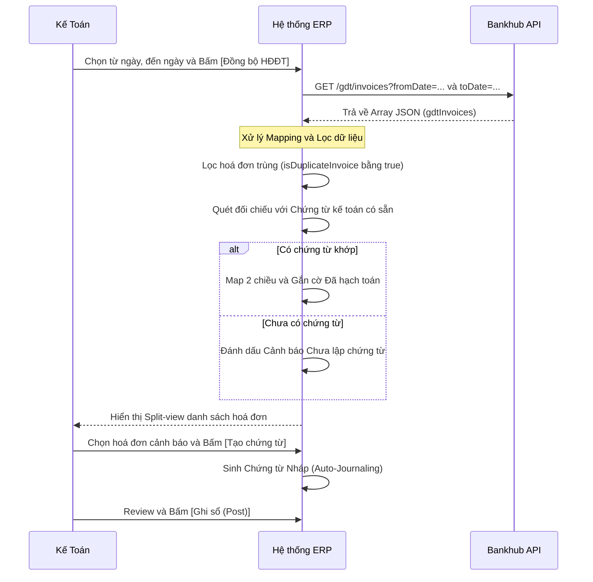

# FRS: F2 - Đồng bộ & Quản lý Hoá đơn điện tử từ Thuế

## 1. Thông tin chung (General Information)
**Mục đích (Purpose):** 
Tính năng này giúp tự động hoá quy trình đồng bộ hoá đơn điện tử (cả đầu vào và đầu ra) từ Tổng cục Thuế về ERP. Từ đó, hỗ trợ kế toán đối soát, tự động map hoá đơn với chứng từ đã có, và gợi ý tạo chứng từ mới cho các hoá đơn "mồ côi" (chưa được hạch toán).

**Phạm vi (Scope):**
- **In-scope:** 
  - Gọi API `GET /gdt/invoices` để kéo dữ liệu hoá đơn theo khoảng thời gian.
  - Hiển thị danh sách hoá đơn (Split-view UI).
  - Tự động map hoá đơn với chứng từ kế toán đã có.
  - Cảnh báo hoá đơn bị trùng lặp hoặc điều chỉnh.
  - Khởi tạo chứng từ nháp (Auto-Journaling) cho hoá đơn mới.
- **Out of scope:** 
  - Quản trị kết nối Bankhub (API Keys/Credentials) - thuộc phân hệ Settings.
  - Chỉnh sửa dữ liệu trực tiếp lên cổng ETAX của Thuế.

**Thuật ngữ (Glossary):**
- **GDT (General Department of Taxation):** Tổng cục Thuế.
- **Hoá đơn "mồ côi":** Hoá đơn kéo từ Thuế về nhưng chưa có chứng từ kế toán nào khớp.
- **Auto-Journaling:** Tự động sinh bút toán Nợ/Có.

---

## 2. Mô tả chức năng chi tiết (Functional Requirements)

### F2.1 Đồng bộ dữ liệu hoá đơn
- **Mô tả:** Gọi API lấy danh sách hoá đơn trong kỳ theo `fromDate` và `toDate`.
- **Tác nhân:** Kế toán viên, Kế toán trưởng.
- **Tiền điều kiện:** Đã cấu hình thành công API Bankhub.
- **Hậu điều kiện:** Dữ liệu JSON hoá đơn được lưu trữ vào CSDL ERP, sàng lọc bỏ các hoá đơn trùng.

### F2.2 Giao diện Split-view và Đối soát Chứng từ
- **Mô tả:** Màn hình chia làm 2 phần: Danh sách hoá đơn và Bản thể hiện chi tiết (mặt hoá đơn).
- **Tác nhân:** Kế toán viên.
- **Tiền điều kiện:** Có dữ liệu hoá đơn trong hệ thống.
- **Hậu điều kiện:** Các hoá đơn được map thành công hiển thị trạng thái "Đã hạch toán"; các hoá đơn mồ côi bị highlight cảnh báo.

### F2.3 Tự động sinh Bút toán (Auto-Journaling)
- **Mô tả:** Với hoá đơn đầu vào chưa có chứng từ, hệ thống tự sinh chứng từ nháp, gợi ý tài khoản chi phí và thuế.
- **Tác nhân:** Kế toán viên.
- **Tiền điều kiện:** Hoá đơn là loại mua vào (`bought`).
- **Hậu điều kiện:** Chứng từ nháp được tạo và liên kết 2 chiều với hoá đơn.

---

## 3. Kịch bản nghiệp vụ (Use Cases & Flows)

### UC-F2-01: Đồng bộ dữ liệu hoá đơn
- **Luồng chính (Happy Path):**
  1. Người dùng chọn từ ngày đến ngày (max 31 ngày) và bấm [Đồng bộ HĐĐT].
  2. ERP gọi API `GET /gdt/invoices`.
  3. API trả về Array `gdtInvoices`.
  4. ERP parse dữ liệu, lọc trùng lặp (`isDuplicateInvoice`).
  5. Dữ liệu mới được insert vào ERP, hiển thị thông báo "Đã đồng bộ X hoá đơn".
- **Luồng ngoại lệ:** Khoảng thời gian > 31 ngày, chặn không cho gọi API.

### UC-F2-02: Mapping và Hạch toán
- **Luồng chính (Happy Path):**
  1. ERP quét danh sách hoá đơn vừa tải về.
  2. Map tự động với các Chứng từ kế toán đã có dựa trên (`invoiceSerial`, `invoiceNumber`, `amount`, mã số thuế).
  3. Những hoá đơn map thành công sẽ chuyển trạng thái sang "Đã hạch toán".
  4. Kế toán click vào hoá đơn "Chưa hạch toán", bấm [Sinh chứng từ nháp].
  5. Hệ thống gợi ý bút toán Nợ/Có, Kế toán kiểm tra và lưu lại.

---

## 4. Tiêu chí nghiệm thu (Acceptance Criteria - AC)

```gherkin
Scenario: Đồng bộ quá 31 ngày
    Given Kế toán chọn fromDate="2026-01-01" và toDate="2026-02-15"
    When Kế toán bấm nút "Đồng bộ HĐĐT"
    Then Hệ thống báo lỗi "Khoảng thời gian tra cứu không được vượt quá 31 ngày"
    And Chặn không gọi API

Scenario: Mapping hoá đơn đầu vào đã có chứng từ
    Given Trong ERP đã có chứng từ mua hàng số X khớp tổng tiền và MST nhà cung cấp
    When Hệ thống đồng bộ hoá đơn điện tử số X về
    Then Hoá đơn X được tự động gán trạng thái "Đã hạch toán"
    And Cung cấp hyperlink nối hoá đơn với chứng từ mua hàng đó

Scenario: Sinh chứng từ nháp cho hoá đơn mua vào
    Given Hoá đơn đầu vào (invoiceType = "bought") chưa có chứng từ
    When Kế toán chọn hoá đơn và bấm "Tạo chứng từ"
    Then Hệ thống tạo phiếu nháp, mặc định ghi Nợ (156/642/...) và Nợ Thuế (1331)
    And Ghi Có vào 331 bằng đúng với financials.totalPaymentAmount
```

---

## 5. Luồng công việc & Sơ đồ (Workflows & Diagrams)



---

## 6. Quy tắc nghiệp vụ (Business Rules)
- **BR-1 (Deduplication):** Không lưu mới hoá đơn nếu `isDuplicateInvoice` bằng true hoặc tổ hợp `[invoiceSerial] + [invoiceNumber] + [seller.taxCode]` đã tồn tại trong database ERP.
- **BR-2 (Alerts):** Hoá đơn có trường `status` báo huỷ hoặc có `hasCorrection` bằng 1 phải hiển thị Banner đỏ/vàng cảnh báo để kế toán không hạch toán nhầm.
- **BR-3 (Split View):** Bắt buộc phân tách 2 Tab `Đầu vào (bought)` và `Đầu ra (sold)` để tránh nhầm lẫn.

---

## 7. Giao diện người dùng (UI/UX Requirements)
- **Split-View Layout:** Màn hình 2 panel. Panel trái (60%) chứa List hoá đơn (có phân trang và filter theo ngày, trạng thái mapping). Panel phải (40%) hiển thị bản thể hiện hoá đơn bằng HTML (hoặc iframe PDF nếu có `customsData`).
- **Trạng thái Mapping (Visuals):**
  - Icon Xanh lá (Đã hạch toán): Link thẳng tới ID Chứng từ.
  - Icon Vàng (Chưa lập chứng từ): Nút [Tạo chứng từ nhanh] hiển thị bên cạnh.
- **Render Mặt Hoá Đơn:** Dựa trên array `lineItems` và object `financials` trả về từ API để vẽ table HTML.

---

## 8. Yêu cầu về dữ liệu (Data Requirements)
- **Data Mapping từ API Response:**
  - Định danh: `id` (UUID) -> `invoice.uuid`, `invoiceSerial` -> `invoice.serial`, `invoiceNumber` -> `invoice.number`.
  - Phân loại: `invoiceType` -> `invoice.type` (`bought` / `sold`), `invoiceFormCode` -> `invoice.form_code`.
  - Giá trị: `amount` -> `invoice.total_amount` (Tổng thanh toán).
  - Đối tác: `seller` object -> Map với `vendor_id`, `buyer` object -> Map với `customer_id`.
  - Ngày giao dịch: `transactionDate` -> `invoice.date`.
- **Data Validation:** 
  - Đảm bảo `lineItems` không rỗng trước khi render bản HTML.
  - Chặn đồng bộ nếu `fromDate` và `toDate` bị null.

---

## 9. Yêu cầu phi chức năng (Non-functional Requirements - NFR)
- **Hiệu năng API:** Xử lý bất đồng bộ (Background job) nếu số lượng hoá đơn kéo về > 1000 bản ghi để tránh timeout giao diện.
- **Audit Logging:** Lưu lại vết ai là người nhấn nút "Đồng bộ HĐĐT" và đồng bộ được bao nhiêu hoá đơn vào ngày nào.
- **Bảo mật:** Không log payload chi tiết `financials` của hoá đơn ra màn hình console của trình duyệt.
