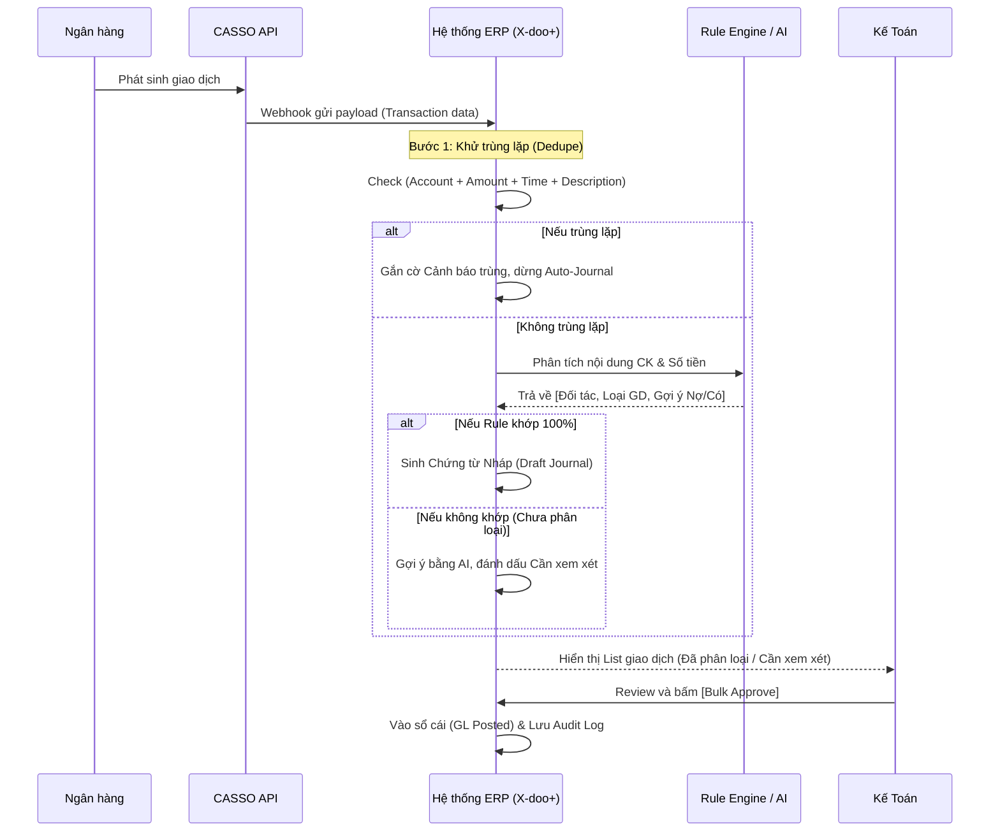

# FRS: F3 - Bank Feed (Đồng Bộ Sao Kê & Hạch Toán Tự Động)

## 1. Thông tin chung (General Information)
**Mục đích (Purpose):**
Tính năng này giúp tự động hoá quy trình kéo sao kê từ ngân hàng thông qua CASSO API, phân loại giao dịch (Rule Engine & AI), tạo chứng từ nháp (Auto-Journaling), và đối soát số dư (Reconciliation) ngay trong ERP mà không cần thao tác thủ công.

**Phạm vi (Scope):**
- **In-scope:**
  - Kết nối tài khoản ngân hàng thông qua CASSO API (hỗ trợ 10+ ngân hàng VN).
  - Đồng bộ danh sách giao dịch (Webhook realtime hoặc Scheduled job).
  - Khử trùng lặp giao dịch (Dedupe) và hiển thị cảnh báo.
  - Phân loại giao dịch tự động qua Rule Engine (hỗ trợ regex/fuzzy match) và gợi ý AI.
  - Tự động sinh chứng từ nháp (Phiếu thu/Phiếu chi) dựa trên phân loại.
  - Giao diện đối soát 3 chiều (Reconciliation view) giữa ERP và sao kê.
  - Phê duyệt hàng loạt (Bulk approve) kèm Audit log.
- **Out of scope:**
  - Thanh toán outbound (chuyển khoản từ ERP) qua API ngân hàng.
  - Dự báo dòng tiền bằng AI/ML.

**Thuật ngữ (Glossary):**
- **Bank Feed:** Luồng dữ liệu giao dịch ngân hàng được đồng bộ tự động vào phần mềm kế toán.
- **Rule Engine:** Bộ quy tắc cấu hình trước để tự động map nội dung chuyển khoản với đối tác và bút toán Nợ/Có.
- **Reconciliation View:** Giao diện đối chiếu số dư sổ quỹ (TK 112) và sao kê ngân hàng thực tế.

---

## 2. Mô tả chức năng chi tiết (Functional Requirements)

### F3.1 Kết nối và Đồng bộ Giao dịch
- **Mô tả:** Kết nối CASSO API để kéo dữ liệu sao kê về ERP qua Webhook (real-time) hoặc Scheduled (batch).
- **Tác nhân:** Admin, Kế toán trưởng.
- **Tiền điều kiện:** Có CASSO API credentials và tài khoản ngân hàng hợp lệ.
- **Hậu điều kiện:** Dữ liệu giao dịch được lưu tại database ERP; tự động loại bỏ giao dịch trùng (Deduplication).

### F3.2 Rule Engine và Phân loại AI
- **Mô tả:** Hệ thống tự động phân tích `description` (nội dung chuyển khoản), `amount` để tìm quy tắc (Rule) phù hợp nhất, từ đó gán thông tin Đối tác, Loại giao dịch (Thu/Chi) và Tài khoản kế toán (112, 131, 331, v.v.).
- **Tác nhân:** Hệ thống tự động, Kế toán viên (cấu hình Rule).
- **Tiền điều kiện:** Có giao dịch chưa phân loại.
- **Hậu điều kiện:** Giao dịch được gán trạng thái "Đã phân loại" (nếu có Rule khớp) hoặc "Cần xem xét" (nếu do AI gợi ý hoặc chưa có Rule).

### F3.3 Auto-Journaling & Bulk Approve
- **Mô tả:** Hệ thống sinh Chứng từ nháp (Draft Journal Entry) dựa trên kết quả phân loại. Kế toán có thể review và duyệt hàng loạt.
- **Tác nhân:** Kế toán viên.
- **Tiền điều kiện:** Giao dịch đã được phân loại.
- **Hậu điều kiện:** Chứng từ được vào sổ cái (GL posted), ghi nhận đầy đủ nhật ký kiểm toán (Audit Log).

### F3.4 Đối soát Số dư (Reconciliation)
- **Mô tả:** Màn hình so sánh số dư TK 112 trên ERP với số dư sao kê hiện tại từ Bank API, highlight các khoản lệch.
- **Tác nhân:** Kế toán trưởng, Kế toán viên.

---

## 3. Kịch bản nghiệp vụ (Use Cases & Flows)

### UC-F3-01: Đồng bộ và Khử trùng lặp giao dịch
- **Luồng chính:**
  1. Ngân hàng có giao dịch mới (Credit/Debit).
  2. CASSO bắn Webhook sang ERP (hoặc ERP chạy crontab lấy batch).
  3. ERP kiểm tra deduplication (cùng bank account, amount, date, description).
  4. Lưu giao dịch thành công.
- **Luồng ngoại lệ:** Phát hiện giao dịch có rủi ro trùng lặp (cùng amount/date nhưng lệch giờ) -> Cắm cờ "Nghi ngờ trùng lặp", chờ user xử lý.

### UC-F3-02: Phân loại bằng Rule Engine và Tạo bút toán
- **Luồng chính:**
  1. ERP nhận giao dịch, chạy qua Rule Engine (VD: nội dung chứa "CTY A" -> Đối tác CTY A).
  2. Rule match thành công -> Tạo Draft Journal Entry (VD: Nợ 112 / Có 131).
  3. Giao dịch hiển thị ở tab "Đã phân loại".
  4. Kế toán review, chọn Bulk Approve.
  5. Hệ thống vào sổ cái và lưu Audit log.
- **Luồng ngoại lệ:** Không có rule nào khớp -> Gắn tag "Chưa phân loại", hiển thị gợi ý của AI. Kế toán chọn tay Đối tác/Tài khoản và lưu lại.

---

## 4. Tiêu chí nghiệm thu (Acceptance Criteria - AC)

```gherkin
Scenario: Webhook đồng bộ giao dịch mới
    Given Tài khoản ngân hàng đã được kết nối qua CASSO
    When Có giao dịch mới phát sinh từ ngân hàng
    Then Giao dịch xuất hiện trong ERP trong vòng 60 giây (với webhook)
    And Hệ thống chạy Rule Engine tạo chứng từ nháp lập tức

Scenario: Khử trùng lặp giao dịch
    Given Có 1 giao dịch ID "TX100" số tiền 5.000.000đ đã tồn tại trong ERP
    When Đồng bộ lại một giao dịch có cùng ID/signature
    Then Hệ thống báo cảnh báo trùng lặp
    And Không tạo chứng từ thứ 2 trừ khi kế toán xác nhận "Bỏ qua trùng lặp"

Scenario: Bulk Approve chứng từ
    Given Có 20 giao dịch ở trạng thái "Đã phân loại" (Draft Journal Entry)
    When Kế toán chọn tất cả và bấm "Approve"
    Then 20 chứng từ được cập nhật trạng thái "Posted" vào sổ cái
    And Audit log ghi lại hành động của user cùng timestamp cho cả 20 bản ghi

Scenario: Màn hình Đối soát (Reconciliation)
    Given Kế toán mở tab Reconciliation
    Then Hệ thống hiển thị: Số dư ERP (TK 112) và Số dư Bankhub
    And Nếu chênh lệch = 0, hiển thị icon tick xanh (Đã khớp)
    And Nếu chênh lệch > 0, liệt kê danh sách giao dịch ERP chưa có trên Bankhub hoặc ngược lại
```

---

## 5. Luồng công việc & Sơ đồ (Workflows & Diagrams)



---

## 6. Quy tắc nghiệp vụ (Business Rules)
- **BR-1 (Rule Match):** Rule Engine sẽ apply theo thứ tự Priority (từ cao xuống thấp). Regex match sẽ được ưu tiên hơn Fuzzy match.
- **BR-2 (Accounting):** Phiếu thu luôn ghi Nợ 112, Phiếu chi luôn ghi Có 112. Đối ứng Nợ/Có phụ thuộc vào loại giao dịch (Thanh toán công nợ 131/331, Chi phí 642, Bán hàng 511).
- **BR-3 (Reconciliation):** Số dư TK 112 không được chỉnh sửa thủ công bằng phiếu kế toán tổng hợp, chỉ được tác động qua luồng Bank Feed hoặc Phiếu Thu/Chi hợp lệ để đảm bảo tính toàn vẹn 3-way matching.

---

## 7. Giao diện người dùng (UI/UX Requirements)
- **Dashboard Giao Dịch:** Có các filter nhanh (Tài khoản NH, Ngày, Trạng thái: Cần xem xét / Đã phân loại / Đã hạch toán).
- **Màn hình Bulk Action:** Hỗ trợ check-box nhiều dòng để duyệt một lúc.
- **Rule Builder UI:** Màn hình đơn giản để kế toán tạo Rule dạng `IF [Nội dung chứa "A"] THEN [Gán Đối tác = B, Loại GD = Thu tiền, Ghi Có 131]`.

---

## 8. Yêu cầu về dữ liệu (Data Requirements)
- **Data Mapping từ CASSO Payload:**
  - `tid` -> `transaction.bank_ref_id`
  - `description` -> `transaction.description` (Nội dung CK)
  - `amount` -> `transaction.amount` (Âm = Chi, Dương = Thu)
  - `when` -> `transaction.date`
  - `corresponsiveName` -> Gợi ý tên người gửi/người nhận.
- **Bảo mật:** Dữ liệu token CASSO phải mã hoá (Encrypted Vault), payload giao dịch phải lưu theo chuẩn compliance.

---

## 9. Yêu cầu phi chức năng (Non-functional Requirements - NFR)
- **Real-time Processing:** Webhook xử lý và tạo Draft Journal trong vòng 5 giây để UX mượt mà.
- **Audit Logging:** Truy xuất được nguồn gốc mọi bút toán 112 (từ Bank TXID nào, Rule nào apply, ai là người Approve).
- **Downtime Fallback:** Nếu Webhook fail, ERP có cơ chế tự động chạy Sync Batch (mỗi giờ 1 lần) để quét các giao dịch bị miss.
