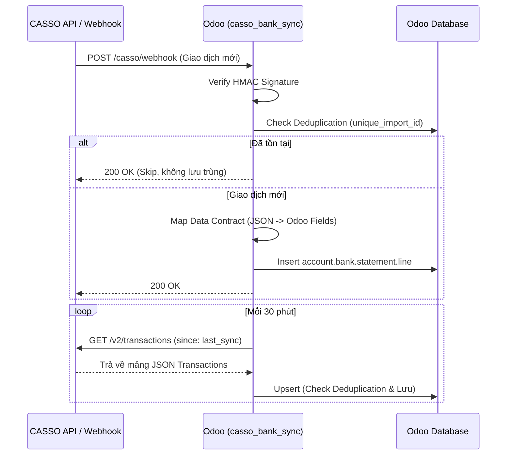

# FRS (Size M): CASSO Bank Sync API (GET /v2/transactions & Webhook)

**Dự án:** CASERP | **Module:** `casso_bank_sync` (M1)
**Người viết:** MinhCQ (PM)
**Người đọc:** Anh Điệp (CEO) & Dev Team

---

## 1. Thông tin chung
*   **Mục đích:** Tự động đồng bộ lịch sử giao dịch ngân hàng từ hệ thống CASSO API (hoặc Webhook) vào bảng `account.bank.statement.line` của Odoo. Giúp kế toán (chị Mỹ) không phải nhập tay hoặc upload file Excel sao kê ngân hàng mỗi ngày.
*   **In-scope (Những gì cần làm):**
    *   Tích hợp API `GET /v2/transactions` chạy theo cơ chế Pull (Cronjob 30 phút/lần).
    *   Tích hợp Webhook payload (cơ chế Push) nhận biến động số dư realtime.
    *   Mapping chuẩn xác dữ liệu từ CASSO JSON Schema sang Odoo Model (`account.bank.statement.line`), đặc biệt là xử lý deduplication (chống trùng lặp).
*   **Out-scope (Những gì KHÔNG làm trong FRS này):**
    *   KHÔNG code thuật toán tự động hạch toán (Auto-Matching & Auto-Journal Entry) trong phase này. Chức năng này sẽ nằm ở FRS của Sprint 2.
    *   KHÔNG tự động tạo Partner (Khách hàng/NCC) mới nếu không tìm thấy trên hệ thống.

## 2. Business Flow (Luồng nghiệp vụ)
Luồng dữ liệu đồng bộ giao dịch ngân hàng từ CASSO về Odoo:

## 3. Tiêu chí Nghiệm thu (Acceptance Criteria - AC)
*(Yêu cầu Dev team dùng chuẩn Gherkin này để viết Unit Test)*

**AC1: Luồng xử lý giao dịch mới thành công (Happy Path)**
*   `Given` Odoo nhận được một payload Webhook hợp lệ từ CASSO.
*   `When` Mã `unique_import_id` (kết hợp `accountNumber` + `reference`) chưa tồn tại trong Database.
*   `Then` Hệ thống tạo thành công 1 bản ghi mới trong `account.bank.statement.line` với số tiền (`amount`), nội dung (`payment_ref`), và các trường custom (như `casso_virtual_account_number`) chính xác.

**AC2: Xử lý chống trùng lặp (Deduplication)**
*   `Given` Odoo nhận được một payload giao dịch từ CASSO qua Webhook HOẶC qua lệnh Cronjob Pull.
*   `When` Giao dịch này đã có trong Database (trùng `unique_import_id`).
*   `Then` Hệ thống bỏ qua (Skip), không tạo bản ghi mới và trả về HTTP 200 OK để CASSO không thực hiện gửi lại.

**AC3: Xử lý dữ liệu không tìm thấy Journal**
*   `Given` Hệ thống nhận được dữ liệu từ CASSO.
*   `When` Trường `accountNumber` từ CASSO không khớp với bất kỳ sổ nhật ký (`account.journal`) nào đang được cấu hình trên Odoo.
*   `Then` Hệ thống reject giao dịch này, không lưu vào DB, ghi nhận Log Error: *"Không tìm thấy Journal cấu hình cho tài khoản {accountNumber}"*.

**AC4: Cơ chế bảo mật Webhook**
*   `Given` Một payload gửi đến endpoint `/casso/webhook`.
*   `When` Chữ ký HMAC Header không khớp hoặc không có chữ ký.
*   `Then` Hệ thống trả về HTTP 401 Unauthorized và từ chối xử lý payload.

## 4. Data Contract (The Shell - Lõi tích hợp)
Đây là phần mapping dữ liệu bắt buộc giữa CASSO API và Odoo Database. Nếu không tuân thủ nghiêm ngặt, dữ liệu sẽ bị sai lệch.

**A. Quy tắc Extend Model (`account.bank.statement.line`)**
Bắt buộc extend các trường sau đây có prefix `casso_` để lưu trữ dữ liệu chuyên sâu phục vụ Audit và Auto-matching sau này:
*   `casso_transaction_datetime` (Datetime): Thời gian giao dịch chuẩn (có time).
*   `casso_running_balance` (Monetary): Số dư sau giao dịch.
*   `casso_virtual_account_number` (Char): Tài khoản ảo (VA) - *Cực kỳ quan trọng để match với hóa đơn bán hàng*.
*   `casso_payment_channel` (Selection): Kênh thanh toán (napas247, internal, citad, swift, other).
*   `casso_counter_bank_bin` (Char): Mã BIN ngân hàng đối ứng (Ví dụ: 970436 cho VCB).
*   `casso_raw_payload` (Text): Toàn bộ cục JSON gốc để phục vụ Debug.

**B. Field Mapping Table (CASSO -> Odoo)**

| CASSO JSON Field | Map vào Odoo Field | Quy tắc (Transformation) |
| :--- | :--- | :--- |
| `reference` + `accountNumber` | `unique_import_id` | Ghép chuỗi: `casso_{accountNumber}_{reference}`. Đây là Key Field bắt buộc để Dedup. |
| `transactionDate` | `date` | Parse sang format Date. |
| `amount` | `amount` | Copy trực tiếp (Đã có sẵn dấu +/- trong payload của CASSO). |
| `description` | `payment_ref` & `narration` | Cắt 64 ký tự đầu cho `payment_ref` (để hiển thị gọn trên UI Odoo). Đưa full text vào `narration` dưới dạng HTML `
...
`. |
| `counterAccountNumber`| `account_number` | Copy trực tiếp. |
| `counterAccountName` | `partner_name` | Copy trực tiếp làm tên tham chiếu. *(Dev sẽ query logic fuzzy match để tìm `partner_id`, nếu tìm thấy thì điền, nếu không thấy thì để trống).* |
| `virtualAccountNumber`| `casso_virtual_account_number`| Copy trực tiếp. Đây là biến sống còn cho module sau (M2). |

## 5. Non-Functional Requirements (NFR)
*   **Performance (Hiệu suất):** Endpoint Webhook `/casso/webhook` phải xử lý JSON và trả về HTTP 200 trong vòng tối đa **1 giây**. Nếu logic query Partner quá chậm, phải chuyển vào background job để không block request của CASSO.
*   **Idempotency (Tính lũy đẳng):** Hệ thống phải an toàn tuyệt đối khi CASSO gửi lại cùng 1 webhook nhiều lần (do timeout mạng). Lỗi *Double-booking* (ghi nhận tiền 2 lần) là lỗi Fatal (Chết người).
*   **Audit Logging:** Bắt buộc lưu toàn bộ `raw_payload` JSON vào trường `casso_raw_payload` (Readonly) để đối soát khi có tranh chấp số liệu hoặc lỗi phát sinh trong tương lai.
