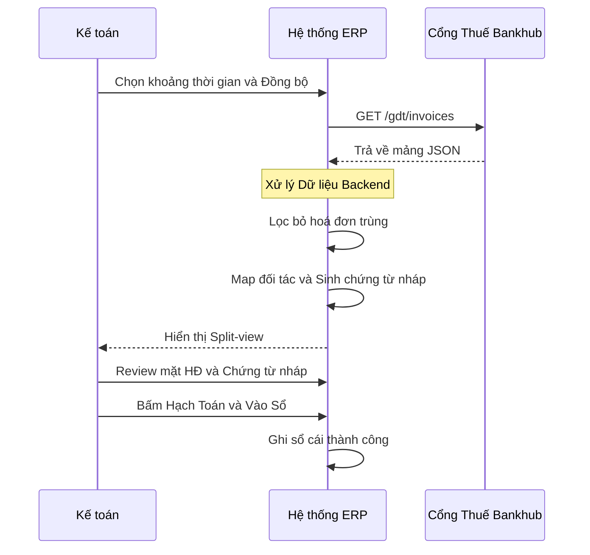

# PRD: X-doo+ Open Banking & Kế Toán Tự Động Hoá

---

**Version:** 1.0

**Last Updated:** 28/04/2026

**Status:** Draft

**Owner:** Product Manager

---

### Changelog

| Version | Ngày | Tác giả | Tóm tắt thay đổi |
| --- | --- | --- | --- |
| 1.0 | 28/04/2026 | PM | Tạo tài liệu ban đầu |

---

## DACI Matrix

| Vai trò | Người/Bộ phận | Trách nhiệm |
| --- | --- | --- |
| **Driver** | Product Manager – X-doo+ | Sở hữu tài liệu, thúc đẩy quyết định |
| **Approver** | CEO / CTO | Phê duyệt cuối (1 người) |
| **Contributor** | Kế toán trưởng (domain expert), Tech Lead CASSO, Backend/Frontend Dev | Đóng góp ý kiến, review, đặt câu hỏi |
| **Informed** | Đội Sales, CS, Legal/Compliance | Được cập nhật, không có vai trò trực tiếp |

---

## 1. Press Release (Working Backwards)

**TIÊU ĐỀ:**

*X-doo+ ra mắt module Open Banking & Kế Toán Tự Động — giúp kế toán SME Việt Nam đóng sổ nhanh hơn 70%, tuân thủ Thông tư 99/2025 ngay từ ngày 01/01/2026.*

**CASSO, 28/04/2026** — X-doo+ (nền tảng ERP kết hợp hệ sinh thái Open Banking của CASSO), công bố tính năng tự động hoá kế toán tích hợp Open Banking, cho phép doanh nghiệp SME Việt Nam đồng bộ hoá đơn điện tử, sao kê ngân hàng, hạch toán chứng từ và đối soát 3 chiều (giao dịch ↔︎ hoá đơn điện tử ↔︎ sổ kế toán) ngay trong ERP — không cần nhập liệu thủ công, không cần xuất file Excel qua lại.

**Vấn đề:** Kế toán viên tại các SME Việt Nam hiện mất 15–25 giờ/tháng chỉ để kéo hoá đơn điển tử, sao kê, đối chiếu thủ công và nhập dữ liệu vào phần mềm kế toán. Áp lực tuân thủ Thông tư 99/2025/TT-BTC (hiệu lực 01/01/2026 thay thế TT200) và NĐ 70/2025/NĐ-CP về hoá đơn điện tử buộc doanh nghiệp phải nâng cấp quy trình. Hầu hết giải pháp hiện tại hoặc là hệ sinh thái đóng (MISA, Fast), hoặc thiếu tích hợp thực sự với ngân hàng Việt Nam.

**Giải pháp:** X-doo+ cung cấp luồng tự động hoàn chỉnh: Sao kê ngân hàng (CASSO) → Rule Engine phân loại → Chứng từ nháp → Phê duyệt → Vào sổ cái — theo đúng hệ thống tài khoản và chuẩn mực VAS của Thông tư 99/2025.

**Trích dẫn khách hàng (đại diện) - Mục tiêu trải nghiệm:**

*“Trước đây tôi mất cả ngày thứ 6 cuối tháng để đối soát sao kê. Bây giờ hệ thống tự làm, tôi chỉ cần approve — tiết kiệm ít nhất 2 ngày làm việc mỗi tháng.”* — Kế toán trưởng, công ty dịch vụ quy mô 50 nhân sự, HCM.

**Bắt đầu:** Khách hàng đang dùng X-doo+ ERP có thể kích hoạt module từ Admin → Integrations → Open Banking trong vòng 15 phút.

---

## 2. Executive Summary

X-doo+ tích hợp CASSO Open Banking API vào phần mềm kế toán nội bộ (Viindoo/Odoo+) để tự động hoá 4 nhóm nghiệp vụ lặp lại cao nhất của kế toán viên SME Việt Nam, căn chỉnh theo **Thông tư 99/2025/TT-BTC**, **26 Chuẩn mực VAS** và **NĐ 70/2025/NĐ-CP**. MVP nhắm đến thời gian 4–6 tuần, ưu tiên luồng mang lại giá trị nhanh nhất cho kế toán viên.

### Kết quả kỳ vọng của PRD này

- Chốt scope MVP và thứ tự ưu tiên 4 tính năng
- Căn chỉnh kỹ thuật giữa team CASSO (Open Banking) và ERP (Viindoo)
- Xác định metric đo lường và giả định cần kiểm chứng sau launch

---

## 3. Bối Cảnh & Cơ Hội

### 3.1 “Why Now” — Tại sao phải làm ngay

| Yếu tố thúc đẩy | Chi tiết |
| --- | --- |
| **Pháp lý – Thông tư 99/2025/TT-BTC** | Hiệu lực 01/01/2026, thay thế TT200/2014. Thay đổi: TK 112 đổi tên thành “Tiền gửi không kỳ hạn”, thêm yêu cầu kết nối số hoá với ngân hàng/hoá đơn điện tử. Phần mềm kế toán phải tuân thủ các yêu cầu chuyên môn nghiệp vụ mới. |
| **Pháp lý – NĐ 70/2025/NĐ-CP** | Hiệu lực 01/06/2025. Bắt buộc một số doanh nghiệp/hộ kinh doanh bán lẻ dùng hoá đơn điện tử khởi tạo từ máy tính tiền. Nhu cầu tích hợp e-invoice vào ERP tăng mạnh. |
| **Pháp lý – Thông tư 64/2024/TT-NHNN** | Hiệu lực 01/03/2025. Chính thức hợp pháp hoá Open Banking API tại Việt Nam. Ngân hàng phải publish API catalogue trước 01/07/2025. Tạo nền tảng pháp lý cho CASSO và X-doo+ hoạt động. |
| **Thị trường** | 10+ ngân hàng lớn (Vietcombank, VietinBank, MB, VPBank, Techcombank, ACB…) đã có API CASSO. Lượng giao dịch chuyển khoản tăng → nhu cầu đối soát tự động tăng tương ứng. |
| **Cạnh tranh** | MISA AMIS & Fast Accounting là closed ecosystem, giá subscription cao, API đắt và khó tuỳ biến. Đây là khoảng trống cho X-doo+ với mô hình mở hơn. |

### 3.2 Competitive Landscape

| Giải pháp hiện tại | Cách người dùng giải quyết | Điểm yếu chúng ta khai thác |
| --- | --- | --- |
| **MISA AMIS** | Dùng module ngân hàng nội bộ | Lock-in, không kết nối ngoài MISA ecosystem, phí cao |
| **Fast Accounting** | Manual import CSV từ internet banking | Thủ công, hay lỗi định dạng, không real-time |
| **Odoo gốc** | Module kế toán thiếu tích hợp VN banking | Không có CASSO/VietQR, tài khoản kế toán không chuẩn VAS/TT99 |
| **Excel + nhập tay** | ~60% SME vẫn dùng Excel | Sai sót cao, không có audit trail, không scalable |
| **Phần mềm kế toán riêng lẻ** | Dùng song song với ERP, đồng bộ tay | Trùng lặp dữ liệu, khó audit, thiếu view tổng thể |

---

## 4. Target Audience

### 4.1 ICP (Ideal Customer Profile)

- **Doanh nghiệp SME Việt Nam**, quy mô 10–200 nhân sự
- Đang dùng hoặc có kế hoạch dùng ERP
- Có ít nhất 1 tài khoản ngân hàng doanh nghiệp tại ngân hàng CASSO hỗ trợ
- Doanh thu 10–200 tỷ VND/năm; giao dịch ngân hàng 100–2,000 lần/tháng
- Ngành: dịch vụ, thương mại, SaaS, logistics — ưu tiên ngành có dòng tiền phức tạp

### 4.2 Personas

### Persona A: Kế toán viên / Kế toán trưởng — “Bị ngập trong thao tác thủ công”

|  | Chi tiết |
| --- | --- |
| **Công việc hàng ngày** | Kéo sao kê từ internet banking, lập và gửi hoá đơn bằng tay lên thuế, đối chiếu với hoá đơn, nhập liệu vào ERP, lập chứng từ tay và hạch toán, cuối tháng lập tờ khai thuế và làm báo cáo |
| **Pain points** | Lập hoá đơn điện tử bằng tay, sao kê lỗi format, lập chứng từ bằng tay (đối chiều dòng tiền, với khoản thu chi), mapping tài khoản kế toán cứng nhắc, lệch công nợ cuối kỳ, thiếu log audit, deadline tờ khai thuế áp lực |
| **Job-to-be-done** | “Khi tôi cần đóng sổ cuối tháng, tôi muốn có một luồng tự động từ lập hoá đơn → giao dịch ngân hàng → chứng từ → sổ cái, ít thao tác và ít sai, để tôi tập trung vào phân tích thay vì nhập liệu.” |
| **Thước đo thành công** | **Đối với các SME có 100–2000 giao dịch ngân hàng/tháng**. **Mục tiêu giảm thời gian vận hành kế toán (theo tuần) của X-doo+:

Tổng thời gian (4 nghiệp vụ)
  • 14h/tuần → 6h/tuần** (giảm ~55–60%)
  • “Mục tiêu đưa phần lớn thao tác từ *làm tay* sang *review/approve*, nên thời gian còn lại chủ yếu là xử lý ngoại lệ.” |

<aside>

Thời gian giảm cụ thể hoá cho các nghiệp vụ phổ biến trong tuần của Kế Toán:

1. **Lập hoá đơn**
- 3h/tuần → 1h/tuần
- Ý nghĩa: chuẩn hoá mẫu + auto-fill thông tin + hạn chế sai sót/điều chỉnh để kế toán chỉ “review & phát hành”.
1. **Hạch toán (hoá đơn + sao kê + phát sinh)**
- 5h/tuần → 2.5h/tuần
- Ý nghĩa: tự động tạo chứng từ nháp từ hoá đơn & giao dịch ngân hàng, kế toán chủ yếu xử lý ngoại lệ + approve.
1. **Đối soát (bank reconciliation + 3-way matching cơ bản)**
- 4h/tuần → 1.5h/tuần
- Ý nghĩa: tự match giao dịch ngân hàng ↔ chứng từ ↔ hoá đơn, chỉ đẩy “case lệch” cho kế toán xử lý.
1. **Lập báo cáo (P&L / dòng tiền / công nợ cơ bản)**
- 2h/tuần → 1h/tuần
- Ý nghĩa: báo cáo tự lên từ sổ cái + dashboard, kế toán chỉ review biến động & ghi chú.
</aside>

### Persona B: Chủ doanh nghiệp / Giám đốc tài chính — “Mù thông tin dòng tiền”

|  | Chi tiết |
| --- | --- |
| **Pain points** | Thu/chi rải rác nhiều tài khoản, không dự báo được 2–4 tuần, khó chứng minh sức khoẻ tài chính khi cần vay vốn |
| **Job-to-be-done** | “Khi tôi cần quyết định chi tiêu lớn hoặc vay vốn, tôi muốn thấy dòng tiền thực tế tổng hợp từ tất cả tài khoản ngân hàng, kết quả kinh doanh và bảng cân đối tài sản ngay trong ERP, để ra quyết định đúng lúc.” |
| **Thước đo thành công** | Có dashboard dòng tiền realtime tổng hợp ≥2 tài khoản ngân hàng |

---

## 5. Problem Statement

SME Việt Nam đang chịu chi phí vận hành cao và rủi ro sai sót do quy trình tài chính–kế toán–thuế bị **phân mảnh** (ngân hàng / hoá đơn điện tử / ERP / cơ quan thuế), dẫn đến:

1. **Nhập liệu thủ công và trùng lặp** — kế toán nhập cùng 1 giao dịch lên 2–3 hệ thống
2. **Đối soát chậm** — lệch số liệu giữa sao kê ngân hàng ↔︎ TK 112 ↔︎ công nợ TK 131/331 gây khó khăn khi đóng sổ
3. **Rủi ro tuân thủ tăng** — Thông tư 99/2025 và NĐ 70/2025 yêu cầu độ chính xác và truy xuất cao hơn mà quy trình thủ công không đáp ứng
4. **Không có audit trail** — thiếu log giải trình khi cơ quan thuế/kiểm toán yêu cầu

**Điều này đặc biệt cấp thiết ngay bây giờ** vì: Thông tư 99/2025 có hiệu lực 01/01/2026 + NĐ 70/2025 từ 01/06/2025 tạo deadline kép. Doanh nghiệp nào chưa có hệ thống tự động sẽ chịu áp lực tuân thủ nặng nề ngay trong quý 1/2026.

---

## 6. Proposed Solution

### 6.1 Tổng quan kiến trúc nghiệp vụ

```
NGÂN HÀNG (10+ banks) + Cơ quan thuế (hoá đơn)
  + Kết nối NHIỀU ngân hàng (multi-bank)
  + 1 nút "Đồng bộ" để lấy sao kê/giao dịch từ tất cả ngân hàng đã kết nối
  + Tự động mapping: Sao kê ↔ chứng từ tiền gửi (sau khi hạch toán/ghi sổ)
  + Kéo hoá đơn đầu vào từ thuế + xem "mặt hoá đơn" + tải/lưu trữ dễ
       ↓ (CASSO Open Banking API / Webhook + e-Invoice/iDOC APIs)
[Hoá đơn điện tử log + Bank Feed Module – X-doo+]
       ↓
[Rule Engine – Phân loại tự động]
  → Tạo Chứng từ: Phân loại mẫu chứng từ (Hoá đơn, sao kê, phát sinh)
  → Gợi ý: Loại giao dịch (Mua vào/Bán ra/Thu/Chi/Phí/Lương...)
  → Gợi ý: Đối tác (KH/NCC theo MST / nội dung CK)
  → Gợi ý: Bút toán Nợ/Có theo TT99 + VAS
       ↓
[Đối soát & Mapping]
  1) Đối soát sao kê ↔ chứng từ tiền gửi (TK 112) đã hạch toán
  2) Đối soát chứng từ mua vào/bán ra ↔ hoá đơn điện tử
  3) Đối soát công nợ (AP/AR): chọn NCC/KH → map chứng từ mua/bán với chứng từ tiền gửi → tự động đối trừ (khi không đặc thù)
       ↓
[Approval Workflow + Ghi sổ theo lô]
  Kế toán review → Approve/Sửa → Bulk approve
  Ghi sổ/Bỏ ghi sổ theo lô an toàn (không giới hạn cứng; không làm sai lệch dữ liệu kế toán)
       ↓
[Vào sổ cái + Sổ cái tổng hợp]
  Tài khoản theo hệ thống TT99/TT133 + Audit log đầy đủ
  Hỗ trợ xem sổ cái tổng hợp của TK mẹ khi có nhiều TK con (roll-up account)
       ↓
[Tờ khai thuế GTGT (đủ phụ lục) + Xuất XML]
  Tạo tờ khai GTGT + phụ lục → xuất XML import HTKK (phase sau: nộp trực tiếp)
       ↓ 
[Lập báo cáo]
  Sổ cái/ BCTC → XML chuẩn VAS → Nộp điện tử
```

### 6.2 Khung pháp lý & chuẩn mực áp dụng

| Văn bản | Phạm vi áp dụng trong sản phẩm |
| --- | --- |
| **TT 99/2025/TT-BTC** | Hệ thống tài khoản kế toán (TK 111, 112, 131, 331, 511, 333x…), biểu mẫu chứng từ (Phụ lục I), mẫu sổ kế toán |
| **TT 133/2016/TT-BTC** | Phục vụ SME nhỏ áp dụng chế độ kế toán giản lược (song song với TT99) |
| **VAS 01** | Nguyên tắc cơ sở dồn tích — ghi nhận doanh thu/chi phí đúng kỳ |
| **VAS 14** | Ghi nhận doanh thu bán hàng, trigger bút toán Nợ 131 / Có 511 + 3331 |
| **VAS 10** | Đánh giá lại ngoại tệ cuối kỳ (nếu có giao dịch USD/EUR) |
| **NĐ 70/2025/NĐ-CP** | E-invoice từ máy tính tiền, trigger luồng kết nối thuế |
| **TT 64/2024/TT-NHNN** | Khung pháp lý Open Banking — cơ sở kết nối CASSO/API ngân hàng |

---

## 7. MVP Scope (4–6 tuần)

### Tổng quan ưu tiên — WSJF Scoring

*WSJF = (Giá trị người dùng + Tính cấp thiết thời gian + Giảm rủi ro) / Nỗ lực*

| Tính năng | Giá trị (1-5) | Cấp thiết (1-5) | Giảm rủi ro (1-5) | Effort | WSJF | Ưu tiên |
| --- | --- | --- | --- | --- | --- | --- |
| F1: MST Autofill + Xuất hoá đơn lên thuế | 4 | 5 | 5 | S | **14/S** | 🥇 #1 |
| F2: Kéo hoá đơn điện tử từ Thuế → lập chứng từ → hạch toán | 5 | 5 | 4 | M | **14/M** | 🥈 #2 |
| F3: Bank Feed → Lập chứng từ → Hạch toán | 5 | 4 | 4 | L | **13/L** | 🥉 #3 |
| F4: Tờ khai thuế tự động | 4 | 3 | 4 | L | **11/L** | #4 |
|  |  |  |  |  |  |  |

---

### F1: Xuất hoá đơn điện tử đầu ra (Bán hàng) + Lập chứng từ nháp đồng thời ⭐ ƯU TIÊN #1

**Mục tiêu:** Phù hợp thói quen kế toán: *lập hoá đơn bán hàng và lập chứng từ cùng lúc*, nhưng chỉ **tự động vào sổ** khi Cơ quan Thuế cấp mã hoá đơn thành công.

**Bối cảnh:** Hiện tại chưa có luồng phát hành HĐĐT tự động hoàn toàn, nên kế toán thường tạo hoá đơn (đầu ra) và lập chứng từ ngay để không “đứt” quy trình bán hàng — sau đó chờ trạng thái từ Cơ quan Thuế.

**Phạm vi (FRS_F1_Xuat_HDDT):**

| Tính năng con | Mô tả |
| --- | --- |
| **Tạo hoá đơn đầu ra + tạo chứng từ nháp (Draft Accounting Entry)** | Khi tạo hoá đơn bán hàng, hệ thống đồng thời tạo chứng từ nháp (journal entry draft) và liên kết 2 chiều Hoá đơn ↔ Chứng từ |
| **Gửi hoá đơn lên Cơ quan Thuế + theo dõi trạng thái** | Gửi XML/hoặc payload theo chuẩn (NĐ 70/2025) lên cổng thuế/provider và cập nhật trạng thái theo phản hồi |
| **Tự động “vào sổ” khi được cấp mã** | Chỉ khi trạng thái phát hành = Success/Cấp mã, hệ thống mới tự động post chứng từ vào sổ cái (Accounting Entry) |
| **Xử lý trạng thái Failed (bắt buộc có Notification)** | Nếu phát hành Failed, ERP bắn thông báo (Notification) cho kế toán biết lý do từ chối để xử lý (sửa/điều chỉnh/gửi lại) |

### Đặc tả Use Case (MVP)

#### UC-F1-01: Tạo hoá đơn đầu ra và tạo chứng từ nháp đồng thời

- **Mục tiêu:** Khi kế toán tạo hoá đơn bán hàng, hệ thống tự tạo chứng từ nháp và liên kết dữ liệu để sẵn sàng vào sổ khi phát hành thành công.
- **Actor chính:** Kế toán viên / Kế toán trưởng
- **Actor phụ (hệ thống):** Sales/Invoice Service, Accounting Service
- **Tiền điều kiện:** Người dùng có quyền tạo hoá đơn và tạo chứng từ.
- **Trigger:** Người dùng bấm “Tạo hoá đơn” (hoặc “Lưu & phát hành”).
- **Luồng chính:**
    1. Người dùng nhập thông tin hoá đơn (khách hàng, dòng hàng, thuế suất, tổng tiền…).
    2. Người dùng bấm “Lưu” hoặc “Lưu & phát hành”.
    3. Hệ thống tạo **Hoá đơn** ở trạng thái nháp (Draft/Pending) và tạo **Chứng từ nháp** tương ứng.
    4. Hệ thống liên kết 2 chiều: Hoá đơn ↔ Chứng từ nháp (kèm nguồn dữ liệu tạo bút toán).
    5. Chứng từ nháp **không post** vào sổ cái tại thời điểm này.
- **Luồng thay thế/ngoại lệ:** Thiếu dữ liệu bắt buộc (MST, địa chỉ, thuế suất…) → chặn lưu/phát hành và hiển thị lỗi.
- **Hậu điều kiện:** Có 1 hoá đơn nháp và 1 chứng từ nháp được liên kết.

#### UC-F1-02: Phát hành hoá đơn lên thuế, nhận trạng thái và tự động vào sổ

- **Mục tiêu:** Đồng bộ trạng thái phát hành; chỉ post sổ cái khi cơ quan thuế cấp mã.
- **Actor chính:** Kế toán viên
- **Actor phụ (hệ thống):** Provider/Cổng Thuế, E-invoice Service, Accounting Posting Service, Notification Service
- **Tiền điều kiện:** Hoá đơn và chứng từ nháp đã tồn tại và liên kết.
- **Trigger:** (a) Người dùng bấm “Phát hành”, hoặc (b) job tự động gửi phát hành theo cấu hình.
- **Luồng chính:**
    1. Hệ thống gửi request phát hành hoá đơn lên Cơ quan Thuế/provider.
    2. Hệ thống cập nhật trạng thái phát hành (ví dụ: Pending/Processing).
    3. Khi nhận kết quả:
        - **Success/Cấp mã**: lưu mã CQT + các metadata (ngày cấp mã, ký hiệu, số…) và **tự động post** chứng từ nháp thành Accounting Entry trong sổ cái.
        - **Failed**: chuyển trạng thái Failed và **bắn Notification** cho kế toán kèm lý do từ chối để xử lý.
- **Luồng thay thế/ngoại lệ:** Timeout/không nhận callback → giữ trạng thái Pending và cho phép retry/tra soát.
- **Hậu điều kiện:** Hoá đơn có trạng thái cuối; chứng từ được post nếu và chỉ nếu Success.

**Effort estimate:** S–M (tuỳ mức tích hợp với provider/cổng thuế)

**Non-goals:** Multi-level approval phức tạp; ký số HSM/token USB (phase 2)

---

### F2: Kéo Hoá Đơn Điện Tử Từ Cơ Quan Thuế ⭐ ƯU TIÊN #2

**Mục tiêu:** Xoá bỏ bước thủ công kéo hoá đơn từ portal Tổng cục Thuế rồi nhập lại vào ERP.

**Vấn đề đang giải quyết:** Kế toán mất 1–3 giờ/tuần tải hoá đơn từ hoadondientu.gdt.gov.vn, kiểm tra trạng thái, rồi nhập lại vào phần mềm kế toán.

**Phạm vi (FRS_F2_Keo_HDDT.md):**

| Tính năng con | Mô tả |
| --- | --- |
| **Kết nối cổng thuế** | OAuth/API kết nối với iDOC (Cổng dữ liệu hoá đơn điện tử - GDT) để kéo danh sách hoá đơn đầu vào/đầu ra theo kỳ |
| **Tự động tạo chứng từ nháp** | Mỗi hoá đơn kéo về → tự sinh draft journal entry: Nợ 156/211/641/642 + Nợ 133 / Có 331 (mua vào) hoặc Nợ 131 / Có 511 + 3331 (bán ra) |
| **Workflow phê duyệt chứng từ** | Kế toán xem danh sách chứng từ nháp → review → Approve/Sửa/Từ chối → Vào sổ cái khi approve |
| **Gửi hoá đơn điện tử lên thuế** | Từ đơn hàng/hợp đồng trong ERP → tạo XML theo chuẩn NĐ 70/2025 → gửi lên cổng thuế → nhận mã CQT (cơ quan thuế) |
| **Theo dõi trạng thái hoá đơn** | Dashboard trạng thái: Chờ cấp mã / Đã cấp mã / Đã huỷ / Điều chỉnh |

**Kết nối mượt với F1:** Dashboard của F2 sẽ:

- Với **hoá đơn đầu ra**: vì hoá đơn đã được tạo chứng từ và hạch toán theo luồng bán hàng, khi người dùng bấm vào 1 hoá đơn đã có **mã CQT** và đã post, dashboard hiển thị rõ **chứng từ đã hạch toán (Posted Accounting Entry)** tương ứng (drill-down từ hoá đơn → chứng từ).
- Với **hoá đơn đầu vào (từ NCC)**: dashboard phải phát hiện các hoá đơn **chưa được mapping với chứng từ** (chưa có Accounting Entry / chưa tạo chứng từ) và hiển thị **signal/cảnh báo nổi bật** để nhắc kế toán lập chứng từ hạch toán kịp thời (tránh sai sót/thiếu hạch toán hoá đơn đầu vào).



### Đặc tả Use Case (MVP)

#### UC-F2-01: Sync hoá đơn điện tử (đầu vào + đầu ra) từ cổng thuế

- **Mục tiêu:** Đồng bộ danh sách hoá đơn theo kỳ, giảm thao tác tải/nhập tay.
- **Actor chính:** Kế toán viên
- **Actor phụ (hệ thống):** iDOC/GDT (hoặc provider), Invoice Service
- **Tiền điều kiện:** Đã cấu hình kết nối cổng thuế; có quyền “Sync hoá đơn”.
- **Trigger:** Người dùng bấm “Sync hoá đơn” hoặc job sync chạy theo lịch.
- **Luồng chính:**
    1. Người dùng chọn kỳ (hoặc hệ thống lấy kỳ mặc định).
    2. Hệ thống gọi API lấy danh sách hoá đơn mua vào + bán ra.
    3. Hệ thống dedupe theo khoá định danh (MST + ký hiệu + số + ngày + tổng tiền).
    4. Hệ thống lưu invoice log, trạng thái đồng bộ và file đính kèm (XML/PDF nếu có).
    5. Hệ thống cập nhật dashboard hoá đơn:
        - **Hoá đơn đầu ra:** nếu hoá đơn đã có **mã CQT** và chứng từ liên quan đã **post**, dashboard hiển thị rõ **chứng từ đã hạch toán (Posted Accounting Entry)** và cho phép drill-down *Hoá đơn → Chứng từ*.
        - **Hoá đơn đầu vào (từ NCC):** dashboard phát hiện các hoá đơn **chưa được mapping với chứng từ** (chưa có Accounting Entry hoặc chưa tạo chứng từ) và hiển thị **signal/cảnh báo nổi bật** để nhắc kế toán xử lý kịp thời.
    6. Hệ thống hiển thị summary: mới / đã có / lỗi.
- **Luồng thay thế/ngoại lệ:**
    - A1. Token hết hạn → yêu cầu re-auth.
    - A2. API lỗi/limit/timeout → ghi log, đánh dấu batch “thất bại”, cho phép retry.
- **Hậu điều kiện:** Invoice log được cập nhật; dashboard phản ánh trạng thái liên kết hoá đơn ↔ chứng từ (đã post / chưa mapping).

#### UC-F2-02: Tạo chứng từ nháp từ hoá đơn (mua vào/bán ra)

- **Mục tiêu:** Từ hoá đơn đã sync, tự sinh draft journal entry đúng nghiệp vụ và gợi ý mapping.
- **Actor chính:** Hệ thống (tự động) / Kế toán (kích hoạt thủ công)
- **Tiền điều kiện:** Hoá đơn đã được sync và hợp lệ tối thiểu (số, ngày, tổng tiền, MST).
- **Trigger:** (a) Sau sync tự động, hoặc (b) người dùng chọn hoá đơn → “Tạo chứng từ nháp”.
- **Luồng chính:**
    1. Hệ thống xác định loại hoá đơn: mua vào hoặc bán ra.
    2. Hệ thống xác định đối tác (Vendor/Customer) theo MST/tên; tạo mới hoặc link với đối tác có sẵn theo rule.
    3. Hệ thống parse dòng hàng hoá/dịch vụ và thuế suất; tính toán net/VAT/total.
    4. Hệ thống sinh bút toán nháp theo TT99:
        - Mua vào: Nợ 156/211/641/642 + Nợ 133 / Có 331
        - Bán ra: Nợ 131 / Có 511 + Có 3331
    5. Hệ thống gắn liên kết hoá đơn ↔ chứng từ nháp và lưu giải thích mapping (nguồn rule/thuế suất/nhóm hàng).
- **Luồng thay thế/ngoại lệ:**
    - A1. Không xác định được tài khoản (156/211/641/642 hoặc 511) → chứng từ nháp vào trạng thái “Cần phân loại”; yêu cầu kế toán chọn mapping.
    - A2. Hoá đơn có chiết khấu/khuyến mại/điều chỉnh → tạo bút toán tương ứng và đánh dấu “Cần kiểm tra”.
    - A3. Hoá đơn trùng/khả nghi trùng → không tạo chứng từ nháp; yêu cầu người dùng xác nhận.
- **Hậu điều kiện:** Có draft journal entry gắn với hoá đơn và sẵn sàng review/approve.

#### UC-F2-03: Review & approve chứng từ nháp (vào sổ)

- **Mục tiêu:** Kế toán review, chỉnh sửa nếu cần và approve để vào sổ cái.
- **Actor chính:** Kế toán viên / Kế toán trưởng (tuỳ phân quyền)
- **Tiền điều kiện:** Có chứng từ nháp; người dùng có quyền approve.
- **Trigger:** Người dùng mở chứng từ nháp và bấm “Approve”.
- **Luồng chính:**
    1. Người dùng mở chứng từ nháp và xem preview hoá đơn (PDF/XML).
    2. Người dùng kiểm tra mapping (đối tác, tài khoản, VAT, chiết khấu nếu có).
    3. Người dùng approve → hệ thống post vào GL và ghi audit log.
    4. Hệ thống đảm bảo liên kết 2 chiều: hoá đơn ↔ chứng từ ↔ file.
- **Luồng thay thế/ngoại lệ:** Lỗi khoá sổ/kỳ kế toán → chặn approve và hiển thị lý do.
- **Hậu điều kiện:** Chứng từ ở trạng thái “Posted/Đã vào sổ”.

**Effort estimate:** M (1–2 tuần, 1 backend + 1 frontend)

**Dependencies:** API cổng thuế (iDOC) hoặc đối tác cung cấp hoá đơn điện tử (MEINVOICE/Viettel)

**Non-goals:** Huỷ/điều chỉnh hoá đơn (phase 2), tích hợp chữ ký số HSM (phase 2)

---

### F3: Bank Feed — Đồng Bộ Sao Kê & Hạch Toán Tự Động ⭐ ƯU TIÊN #3

**Mục tiêu:** Xoá bỏ bước kéo sao kê thủ công và nhập giao dịch vào TK 112 trong ERP.

**Vấn đề đang giải quyết:**

Kế toán viên phải vào internet banking của từng ngân hàng, xuất CSV, format lại, rồi import/nhập tay vào phần mềm kế toán — lặp lại hàng ngày/tuần.

**Phạm vi:**

| Tính năng con | Mô tả |
| --- | --- |
| **Kết nối tài khoản ngân hàng** | Kết nối qua CASSO API (hỗ trợ 10+ ngân hàng VN); cấu hình tài khoản, lịch sync (real-time webhook hoặc scheduled), chọn ngày bắt đầu đồng bộ |
| **Danh sách giao dịch** | Hiển thị giao dịch với filter: tài khoản / ngày / số tiền / nội dung / trạng thái (Chưa phân loại / Đã phân loại / Đã hạch toán) |
| **Dedupe & cảnh báo lỗi** | Phát hiện giao dịch trùng lặp (cùng số tiền + ngày + nội dung trong 24h), cảnh báo sync thất bại |
| **Rule Engine phân loại tự động** | Quy tắc cấu hình: nếu nội dung CK chứa “CONG TY A” → đối tác = Công ty A, loại = Thu tiền KH, bút toán = Nợ 112 / Có 131; Hỗ trợ regex và fuzzy match |
| **Gợi ý phân loại bằng AI/ML** | Dựa trên lịch sử phân loại, gợi ý category cho giao dịch mới chưa có rule |
| **Tạo chứng từ nháp tự động** | Từ giao dịch đã phân loại → tạo draft: Phiếu thu (Nợ 112 / Có 131 hoặc 511), Phiếu chi (Nợ 331 hoặc 641 / Có 112), Hoặc flag “Cần xem xét” |
| **Bulk approve + audit log** | Checkbox chọn nhiều chứng từ → Approve hàng loạt; mỗi action ghi log user + timestamp |
| **Reconciliation view** | So sánh số dư TK 112 trên ERP vs số dư sao kê ngân hàng; highlight khoản chênh lệch |

**Hệ thống tài khoản TT99 liên quan:**

| Giao dịch | Bút toán tự động |
| --- | --- |
| Thu tiền từ khách hàng (KH trả nợ) | Nợ TK 112 / Có TK 131 |
| Thu tiền bán hàng trực tiếp | Nợ TK 112 / Có TK 511 + Có TK 3331 |
| Thanh toán nhà cung cấp | Nợ TK 331 / Có TK 112 |
| Chi phí ngân hàng (phí dịch vụ) | Nợ TK 635 hoặc 642 / Có TK 112 |
| Tiền nhận trước của KH | Nợ TK 112 / Có TK 131 (dư Có) |
| Nộp thuế | Nợ TK 333x / Có TK 112 |

### Đặc tả Use Case (MVP)

#### UC-F3-01: Đồng bộ giao dịch ngân hàng (Bank Feed sync)

- **Mục tiêu:** Lấy giao dịch ngân hàng vào ERP theo lịch hoặc real-time để kế toán không cần export/import.
- **Actor chính:** Kế toán viên
- **Actor phụ (hệ thống):** CASSO API/Webhook, Bank Feed Service
- **Tiền điều kiện:** Tài khoản ngân hàng đã kết nối; cấu hình lịch sync hoặc webhook; có quyền xem danh sách giao dịch.
- **Trigger:** (a) Webhook giao dịch mới, hoặc (b) job sync chạy, hoặc (c) người dùng bấm “Đồng bộ”.
- **Luồng chính:**
    1. Hệ thống nhận giao dịch mới (credit/debit) và chuẩn hoá dữ liệu.
    2. Hệ thống dedupe (theo thời gian/số tiền/nội dung/tx id).
    3. Hệ thống lưu danh sách giao dịch và trạng thái “Chưa phân loại”.
    4. Hệ thống hiển thị giao dịch theo filter (tài khoản/ngày/số tiền/trạng thái).

#### UC-F3-02: Phân loại giao dịch bằng Rule Engine & gợi ý

- **Mục tiêu:** Tự động gán loại giao dịch/đối tác/tài khoản dựa trên rule + lịch sử.
- **Actor chính:** Kế toán viên
- **Tiền điều kiện:** Có giao dịch ở trạng thái “Chưa phân loại”.
- **Trigger:** Giao dịch mới được sync hoặc người dùng bấm “Áp dụng rule”.
- **Luồng chính:** Áp rule (regex/fuzzy) → gợi ý category/đối tác → gắn nhãn kết quả và độ tin cậy.

#### UC-F3-03: Tạo chứng từ nháp từ giao dịch & approve vào sổ

- **Mục tiêu:** Từ giao dịch đã phân loại, tự tạo phiếu thu/chi/chứng từ và cho approve hàng loạt.
- **Actor chính:** Kế toán viên / Kế toán trưởng
- **Tiền điều kiện:** Giao dịch có phân loại hợp lệ; có quyền approve.
- **Trigger:** Người dùng chọn giao dịch → “Tạo chứng từ nháp” hoặc auto-create theo cấu hình.
- **Luồng chính:** Tạo draft JE → người dùng review → approve/bulk approve → post GL + audit log.

#### UC-F3-04: Đối soát (Reconciliation) giữa sao kê và TK 112

- **Mục tiêu:** So khớp số dư và mapping giao dịch ↔ chứng từ đã vào sổ để phát hiện chênh lệch.
- **Actor chính:** Kế toán viên
- **Tiền điều kiện:** Có dữ liệu bank feed và chứng từ tiền gửi (TK 112) đã post.
- **Trigger:** Người dùng mở màn hình reconciliation.
- **Luồng chính:** Tính số dư/đối chiếu → highlight chênh lệch → cho phép drill-down nguyên nhân.

**Effort estimate:** L (2–3 tuần, 1 backend + 1 frontend + 1 QA)

**Dependencies:** CASSO API credentials, cấu hình ngân hàng từ phía khách hàng

**Non-goals:** Thanh toán outbound qua API ngân hàng (phase 3), dự báo dòng tiền ML (phase 3)

---

### F4: Tờ Khai Thuế Tự Động ⭐ ƯU TIÊN #4

**Mục tiêu:** Giảm thời gian lập tờ khai thuế GTGT hàng tháng/quý từ 4–8 giờ xuống còn 30–60 phút.

**Vấn đề đang giải quyết:**

Kế toán phải tổng hợp số liệu từ nhiều nơi (ERP + sổ sách + sao kê) rồi nhập tay vào phần mềm HTKK, xuất XML, đối chiếu lại trước khi nộp.

**Phạm vi MVP:**

| Tính năng con | Mô tả |
| --- | --- |
| **Tổng hợp dữ liệu tờ khai GTGT (01/GTGT)** | Tự động tổng hợp doanh thu (TK 511), thuế đầu ra (TK 3331), thuế đầu vào được khấu trừ (TK 133) từ GL trong kỳ → map vào các chỉ tiêu tờ khai 01/GTGT |
| **Đối soát số liệu** | So sánh số liệu tờ khai với sổ kế toán; highlight chênh lệch và giải thích nguyên nhân |
| **Xuất XML chuẩn HTKK** | Generate file XML theo schema Tổng cục Thuế (HTKK 4.x) từ dữ liệu đã đối soát |
| **Nộp điện tử (basic)** | Upload XML lên cổng thuế điện tử (eTax) qua API hoặc hướng dẫn thao tác tay |

### Đặc tả Use Case (MVP)

#### UC-F4-01: Tạo tờ khai thuế GTGT (01/GTGT) từ sổ cái

- **Mục tiêu:** Tự động tổng hợp và map dữ liệu GL vào chỉ tiêu tờ khai 01/GTGT.
- **Actor chính:** Kế toán thuế / Kế toán trưởng
- **Actor phụ (hệ thống):** Tax Report Service, GL Service
- **Tiền điều kiện:** Dữ liệu GL trong kỳ đã được post; cấu hình kỳ khai thuế; cấu hình mapping chỉ tiêu.
- **Trigger:** Người dùng chọn kỳ và bấm “Tạo tờ khai GTGT”.
- **Luồng chính:**
    1. Người dùng chọn kỳ (tháng/quý) và loại tờ khai.
    2. Hệ thống tổng hợp doanh thu (TK 511), thuế đầu ra (TK 3331), thuế đầu vào (TK 133) theo kỳ.
    3. Hệ thống map vào chỉ tiêu tờ khai 01/GTGT và tạo bản preview.
    4. Hệ thống hiển thị variance so với kỳ trước và các nguồn dữ liệu (drill-down theo bút toán).
- **Luồng thay thế/ngoại lệ:**
    - A1. Dữ liệu chưa đủ điều kiện (ví dụ: chưa đối soát hoá đơn ↔ chứng từ hoặc sao kê ↔ TK 112 theo rule) → hiển thị cảnh báo và danh sách mục cần xử lý (blocking hoặc non-blocking theo cấu hình).

#### UC-F4-02: Xuất XML HTKK từ tờ khai

- **Mục tiêu:** Xuất XML đúng schema HTKK để import/nộp.
- **Actor chính:** Kế toán thuế
- **Tiền điều kiện:** Có bản tờ khai đã tạo và được người dùng xác nhận.
- **Trigger:** Người dùng bấm “Xuất XML”.
- **Luồng chính:** Validate dữ liệu → generate XML theo schema → tải xuống/lưu trữ → ghi audit log.

**Effort estimate:** L (2–3 tuần, 1 backend + 1 frontend)

**Dependencies:** F1 (MST chuẩn) + F2 (hoá đơn đã vào sổ) + F3 (sao kê đã hạch toán) phải hoàn thành

**Non-goals:** Tờ khai TNDN / PIT (phase 2), ký số điện tử (phase 2), nộp tự động 100% không cần review (phase 3)

---

## 8. Non-Goals (Những gì KHÔNG làm trong MVP)

- Thanh toán outbound qua API ngân hàng (chuyển khoản từ ERP)
- Dự báo dòng tiền và cashflow intelligence (ML/AI model)
- Tích hợp chữ ký số (HSM/token USB)
- Tờ khai thuế TNDN, Thuế Thu Nhập Cá Nhân, BHXH
- Kết nối với phần mềm POS của bên thứ 3 (Sapo, KiotViet…)
- Multi-currency accounting nâng cao (chỉ VND + gợi ý tỷ giá USD/EUR cơ bản)
- Module tín dụng / credit scoring
- Doanh nghiệp FDI, kế toán theo IFRS (chỉ tập trung VAS/TT99)

---

## 9. Success Metrics

### Primary Metrics (Đo sau 8 tuần post-launch)

| Metric | Baseline (hiện tại) | Target | Cách đo |
| --- | --- | --- | --- |
| Thời gian xử lý sao kê/tháng (Persona A) | 15 giờ/tháng | ≤ 4 giờ/tháng (-73%) | In-app time tracking + user survey |
| Tỷ lệ chứng từ tạo tự động / tổng chứng từ | 0% | ≥ 60% | ERP analytics |
| Số giao dịch ngân hàng được phân loại đúng tự động | N/A | ≥ 75% (không cần sửa) | Rule engine accuracy log |
| Tỷ lệ hoá đơn điện tử kéo về thành công | N/A | ≥ 95% | API success rate |
| Thời gian đóng sổ cuối tháng | 3–5 ngày | ≤ 1,5 ngày | Monthly close date log |

### Secondary Metrics

| Metric | Target |
| --- | --- |
| Tỷ lệ adoption (% user kích hoạt bank feed trong 30 ngày) | ≥ 40% của khách hàng X-doo+ active |
| NPS của kế toán viên sau 8 tuần | ≥ 35 |
| Tỷ lệ lỗi sai sót khi vào sổ (audit finding) | Giảm ≥ 50% so với quy trình thủ công |
| Số MST tra cứu thành công / tổng request | ≥ 99% (API GDT uptime) |

### Guardrail Metrics (Không được vi phạm)

- Audit trail phải đầy đủ 100% cho mọi chứng từ được tạo/sửa/approve
- Không có giao dịch nào bị vào sổ mà không qua bước approval của kế toán
- Dữ liệu ngân hàng phải được mã hoá trong transit (TLS 1.3) và at rest (AES-256)

---

## 10. Technical Considerations & Assumptions

### Giả định cần kiểm chứng

| # | Giả định | Rủi ro nếu sai | Cách kiểm chứng |
| --- | --- | --- | --- |
| A1 | CASSO API có uptime ≥99.5% cho 10+ ngân hàng | Bank feed không reliable → mất trust | Xem SLA contract CASSO, pilot 2 tuần với 1 bank |
| A2 | API cổng thuế (iDOC) ổn định đủ để kéo hoá đơn realtime | F2 phải fallback sang upload tay | Spike test với test account GDT trong sprint 1 |
| A3 | Kế toán viên sẵn sàng thay đổi workflow sang approve-based | Change resistance → adoption thấp | Thực hiện 5 user interviews với kế toán trưởng trước launch |
| A4 | Rule engine 75%+ accuracy đủ để giảm workload | Nếu <60%, kế toán vẫn phải làm tay nhiều → không đủ value | Backtest với dữ liệu lịch sử thực tế từ 2–3 khách hàng pilot |
| A5 | Schema XML HTKK/iDOC không thay đổi trong Q1/2026 | Phải update parser → regression risk | Đăng ký nhận thông báo thay đổi từ GDT, có versioning cho XML parser |

### Phụ thuộc kỹ thuật

| Phụ thuộc | Owner | Rủi ro |
| --- | --- | --- |
| CASSO API key & contract | Business Dev | Cần ký SLA trước sprint 2 |
| iDOC/GDT API credentials | Compliance team | Cần tài khoản doanh nghiệp, xử lý 2–4 tuần |
| Hệ thống tài khoản TT99 trong Viindoo | Dev Lead | Cần update chart of accounts trước F3 |
| Infrastructure security audit | DevOps | Audit trước khi lưu token ngân hàng |

### Security & Compliance Requirements

- Token CASSO và credentials ngân hàng phải lưu trong encrypted vault (không plain text trong DB)
- Mỗi API call đến cổng thuế phải có logging đầy đủ (request/response, timestamp, user)
- Quyền truy cập bank feed phân tầng: Admin (cấu hình) / Accountant (sync + approve) / Viewer (xem report)
- Tuân thủ Luật An toàn Thông tin mạng 2015 và Nghị định 13/2023/NĐ-CP về bảo vệ dữ liệu cá nhân

---

## 11. Roadmap

### Now (Sprint 1–2, tuần 1–3)

| Tính năng | Owner | Metric thành công |
| --- | --- | --- |
| F1: MST Autofill & XML Export | Backend dev A | 100% form có thể tra cứu MST + XML export hợp lệ |
| Cấu hình hệ thống tài khoản TT99 trong Viindoo | Dev Lead | Chart of accounts update xong |
| Spike: Test API CASSO + API GDT | Backend dev B | Xác nhận feasibility + uptime |

### Next (Sprint 3–4, tuần 4–6)

| Tính năng | Phụ thuộc | Metric thành công |
| --- | --- | --- |
| F2: Kéo hoá đơn điện tử + Approval workflow | F1 hoàn thành + API GDT confirmed | ≥90% hoá đơn kéo về tạo đúng draft journal entry |
| F3: Bank Feed + Rule Engine + Auto-Journal | CASSO contract ký + TK TT99 setup | ≥75% giao dịch được phân loại đúng tự động |

### Later (tuần 7+, directional)

- F4: Tờ khai thuế tự động (01/GTGT)
- Cashflow dashboard (tổng hợp multi-account)
- Tích hợp chữ ký số cho e-invoice
- Tờ khai TNDN, PIT, BHXH
- Dự báo dòng tiền AI (Persona B use case)
- Kết nối POS bên thứ 3 (Sapo, KiotViet)

---

## 12. Open Questions

| # | Câu hỏi | Owner | Deadline |
| --- | --- | --- | --- |
| OQ1 | CASSO có SDK embedded (Plaid Link-style) để user tự link ngân hàng trong ERP UI không, hay vẫn cần user login portal CASSO riêng? | Business Dev + CASSO team | Sprint 1 |
| OQ2 | Đối với TT133 (doanh nghiệp siêu nhỏ), có cần chart of accounts riêng hay dùng chung TT99 với filter? | Dev Lead + Domain Expert | Sprint 1 |
| OQ3 | iDOC API hỗ trợ kéo hoá đơn đầu vào (mua) real-time hay chỉ batch theo ngày? Rate limit là bao nhiêu? | Backend dev B | Sprint 1 |
| OQ4 | Ai là người approval final trong workflow (kế toán viên hay kế toán trưởng)? Có cần multi-level approval không? | UX Research | Sprint 2 |
| OQ5 | Willingness-to-pay: Kế toán SME sẵn sàng trả thêm bao nhiêu/tháng cho tính năng bank feed? (Cần user interview) | PM | Trước Sprint 3 |
| OQ6 | CASSO Hub hay CASSO API thuần? Licensing model cho enterprise customer của X-doo+? | Business Dev | Sprint 2 |

---

## Phụ lục A: Mapping Nghiệp Vụ Kế Toán → Tính Năng Sản Phẩm

| Nghiệp vụ kế toán (TT99/VAS) | Tính năng X-doo+ |
| --- | --- |
| Ghi nhận tiền gửi không kỳ hạn (TK 112) | F3: Bank Feed sync |
| Đối chiếu sổ kế toán vs sao kê ngân hàng | F3: Reconciliation view |
| Hạch toán khoản phải thu (TK 131) từ thu tiền NH | F3: Rule Engine → Nợ 112 / Có 131 |
| Hạch toán khoản phải trả (TK 331) khi thanh toán | F3: Rule Engine → Nợ 331 / Có 112 |
| Ghi nhận hoá đơn mua vào (Nợ 133 + 156/642 / Có 331) | F2: E-invoice auto-journal |
| Ghi nhận hoá đơn bán ra (Nợ 131 / Có 511 + 3331) | F2: E-invoice auto-journal |
| Kiểm tra thông tin pháp lý đối tác (MST) | F1: MST Autofill |
| Xuất số liệu nộp thuế GTGT (Chỉ tiêu 01/GTGT) | F1: XML Export + F4: Tờ khai tự động |
| Đánh giá lại ngoại tệ TK 112 cuối kỳ (VAS 10) | Phase 2 |
| Lập dự phòng phải thu khó đòi (TK 2293) | Phase 2 |

---

## Phụ lục B: Glossary

| Thuật ngữ | Định nghĩa |
| --- | --- |
| **Bank Feed** | Luồng dữ liệu giao dịch ngân hàng được đồng bộ real-time vào phần mềm kế toán |
| **Rule Engine** | Công cụ áp dụng quy tắc phân loại giao dịch tự động dựa trên nội dung chuyển khoản, số tiền, đối tác |
| **3-Way Matching** | Đối soát 3 chiều giữa: (1) giao dịch ngân hàng ↔︎ (2) hoá đơn điện tử ↔︎ (3) chứng từ kế toán |
| **Draft Journal Entry** | Bút toán kế toán nháp, chưa được vào sổ cái, chờ kế toán review và approve |
| **MST** | Mã số thuế — định danh pháp lý của doanh nghiệp/cá nhân kinh doanh tại Việt Nam |
| **TK (Tài khoản)** | Tài khoản kế toán trong hệ thống tài khoản theo Thông tư 99/2025/TT-BTC |
| **VAS** | Vietnamese Accounting Standards — 26 Chuẩn mực Kế toán Việt Nam |
| **TT99** | Thông tư 99/2025/TT-BTC — Chế độ kế toán doanh nghiệp mới, hiệu lực 01/01/2026 |
| **CASSO** | Fintech Việt Nam cung cấp Open Banking middleware kết nối 10+ ngân hàng VN |
| **iDOC** | Cổng dữ liệu hoá đơn điện tử của Tổng cục Thuế Việt Nam |
| **HTKK** | Hỗ trợ kê khai thuế — phần mềm và schema XML chuẩn của Tổng cục Thuế |
| **GL** | General Ledger — Sổ cái kế toán |
| **AR/AP** | Accounts Receivable / Accounts Payable — Phải thu / Phải trả |
| **Audit Log** | Nhật ký kiểm toán — ghi lại mọi thao tác thay đổi dữ liệu |
