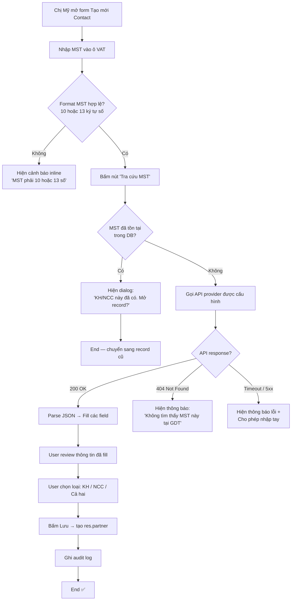
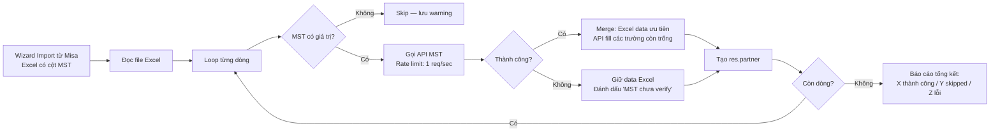

# FRS — Module Tạo KH/NCC Tự Động Từ API MST

> **Mã module:** `caserp_partner_mst_lookup`
> **Feature tag:** F-MST-AUTO (extension của F10 trong roadmap)
> **Size:** M (Medium) — FRS chuẩn + Dev "vibe code" với Cursor
> **PM:** MinhCQ &nbsp;|&nbsp; **Dev assignee:** Dev2 &nbsp;|&nbsp; **Sprint:** Sprint 3 (9–22/6/2026)
> **Phiên bản:** v1.0 — *13/05/2026*

---

## 1. Thông tin chung

### 1.1. Mục đích

Khi chị Mỹ (kế toán) nhập một MST mới vào ô "Khách hàng" hoặc "Nhà cung cấp" trên Odoo, hệ thống sẽ **tự động gọi API tra cứu** thông tin doanh nghiệp từ cơ sở dữ liệu Tổng cục Thuế và **điền sẵn các trường thông tin** (tên công ty, địa chỉ, loại hình, tình trạng hoạt động). Chị Mỹ chỉ cần xác nhận và lưu.

**Bài toán đang giải:**

| Trước (Misa / Odoo vanilla) | Sau khi có module này |
|---|---|
| Chị Mỹ gõ tay MST + tên + địa chỉ → mất ~45 giây / KH | Gõ MST → bấm tra cứu → 5 giây xong |
| Sai chính tả tên công ty rất phổ biến → hóa đơn bị từ chối khi đối chiếu thuế | Tên đồng nhất 100% với dữ liệu Tổng cục Thuế |
| Phải mở tab khác (masothue.com, tracuunnt.gdt.gov.vn) để copy/paste | Tra cứu ngay trong Odoo |

> **ROI ước tính:** Với ~200 KH/NCC mới mỗi quý ở CASSO → tiết kiệm ~2.5 giờ/quý cho 1 kế toán. Quan trọng hơn: **giảm sai sót → giảm rủi ro bị thuế hồi tố**.

---

### 1.2. Scope

**✅ IN-SCOPE (phiên bản này):**

1. Thêm nút **"Tra cứu MST"** trên form `res.partner` (Contact/Customer/Vendor).
2. Khi bấm nút → gọi API → fill các trường: `name`, `vat`, `street`, `company_type`, `is_company`, `comment` (ghi chú nội bộ).
3. Hỗ trợ **3 loại đối tượng** theo dữ liệu Tổng cục Thuế:
   - Doanh nghiệp / Tổ chức (MST 10 số)
   - Chi nhánh / VPĐD (MST 13 số có dấu gạch: `0123456789-001`)
   - Hộ kinh doanh cá thể (MST 10 số dạng riêng)
4. **Validation đầu vào**: format MST + check duplicate trong DB.
5. **Cấu hình provider** API (cho phép admin đổi nhà cung cấp dữ liệu trong Settings).
6. **Audit log**: mỗi lần tra cứu lưu lại ai gọi, MST nào, thành công/thất bại.
7. Bulk lookup (gọi hàng loạt từ wizard import danh mục — tích hợp với module F10).

**❌ OUT-OF-SCOPE (KHÔNG làm trong sprint này — để AI không tự code lan man):**

1. ❌ Không tra cứu MST cá nhân (CCCD-based) — phiên bản sau.
2. ❌ Không tự động cập nhật định kỳ thông tin KH/NCC khi MST đổi tình trạng hoạt động (cron sync) — Q3.
3. ❌ Không UI thiết kế lại — dùng nguyên form `res.partner` của Odoo, chỉ thêm 1 nút.
4. ❌ Không tích hợp AI / fuzzy matching tên công ty.
5. ❌ Không hỗ trợ tra cứu MST nước ngoài.
6. ❌ Không tự gán `customer_rank` hay `supplier_rank` dựa trên phỏng đoán — user phải chủ động check.

---

## 2. Business Flow

### 2.1. Sơ đồ luồng chính — Tra cứu MST đơn lẻ



### 2.2. Sơ đồ luồng phụ — Bulk lookup khi import từ Misa



> 📌 *Không có wireframe trong tài liệu này vì module dùng nguyên form `res.partner` mặc định của Odoo, chỉ thêm 1 nút "Tra cứu MST" bên cạnh field VAT.*

---

## 3. Acceptance Criteria (Gherkin)

> **Lưu ý cho Dev:** Mỗi `Scenario` dưới đây tương ứng với 1 unit test / integration test. Khi dùng Cursor, paste section này vào prompt để AI tự sinh test cases với pytest + odoo test framework.

### 3.1. Validate format MST

```gherkin
Feature: Validate định dạng MST trước khi gọi API

  Scenario: MST 10 số hợp lệ
    Given chị Mỹ đang ở form tạo mới Contact
    When chị nhập "0123456789" vào field VAT
    And chị bấm nút "Tra cứu MST"
    Then hệ thống đi tới bước gọi API
    And không hiện cảnh báo format

  Scenario: MST 13 ký tự (chi nhánh) hợp lệ
    Given chị Mỹ đang ở form tạo mới Contact
    When chị nhập "0123456789-001" vào field VAT
    And chị bấm nút "Tra cứu MST"
    Then hệ thống đi tới bước gọi API
    And không hiện cảnh báo format

  Scenario: MST có ký tự không phải số
    Given chị Mỹ đang ở form tạo mới Contact
    When chị nhập "012345ABCD" vào field VAT
    And chị bấm nút "Tra cứu MST"
    Then hệ thống KHÔNG gọi API
    And hiện cảnh báo "MST chỉ được chứa số và dấu gạch ngang"

  Scenario: MST quá ngắn
    Given chị Mỹ đang ở form tạo mới Contact
    When chị nhập "12345" vào field VAT
    And chị bấm nút "Tra cứu MST"
    Then hệ thống KHÔNG gọi API
    And hiện cảnh báo "MST phải có 10 hoặc 13 ký tự số"

  Scenario: MST có khoảng trắng đầu/cuối
    Given chị Mỹ đang ở form tạo mới Contact
    When chị nhập "  0123456789  " vào field VAT
    And chị bấm nút "Tra cứu MST"
    Then hệ thống tự động trim khoảng trắng
    And gọi API với giá trị "0123456789"
```

### 3.2. Check duplicate trong DB

```gherkin
Feature: Phát hiện MST đã tồn tại để tránh tạo trùng

  Scenario: MST đã tồn tại trong res.partner
    Given trong DB đã có partner "CÔNG TY ABC" với VAT = "0123456789"
    And chị Mỹ đang tạo mới Contact
    When chị nhập "0123456789" và bấm "Tra cứu MST"
    Then hệ thống KHÔNG gọi API ra ngoài
    And hiện dialog "Đã có KH/NCC với MST này: CÔNG TY ABC. Mở record cũ?"
    And có 2 nút: "Mở record cũ" và "Tạo trùng (không khuyến nghị)"

  Scenario: MST đã tồn tại — User chọn mở record cũ
    Given dialog duplicate đang hiện
    When chị bấm "Mở record cũ"
    Then form hiện tại bị bỏ
    And chuyển sang form edit của partner "CÔNG TY ABC"

  Scenario: Duplicate check không phân biệt format
    Given trong DB có partner với VAT = "0123456789"
    When chị nhập "0123456789-000" (chi nhánh trụ sở chính)
    Then hệ thống nhận diện là cùng MST và hiện cảnh báo
```

### 3.3. Gọi API thành công

```gherkin
Feature: Tra cứu MST trả về dữ liệu hợp lệ

  Scenario: Tra cứu MST doanh nghiệp đang hoạt động
    Given MST "0101248141" tồn tại tại Tổng cục Thuế
    And tình trạng hoạt động là "NNT đang hoạt động"
    When chị Mỹ tra cứu MST này
    Then hệ thống fill các trường:
      | Field         | Giá trị mong đợi                                           |
      | name          | CÔNG TY CỔ PHẦN FPT                                        |
      | vat           | 0101248141                                                 |
      | street        | Số 10 phố Phạm Văn Bạch, Phường Cầu Giấy, TP Hà Nội         |
      | is_company    | True                                                       |
      | company_type  | company                                                    |
      | comment       | [Auto-filled] Loại: Doanh nghiệp \| Tình trạng: Đang hoạt động \| CQT: Chi cục Thuế Doanh nghiệp lớn |
    And hiện toast success "Đã tra cứu thành công"

  Scenario: Tra cứu MST chi nhánh
    Given MST "0101248141-001" là chi nhánh của FPT
    When chị Mỹ tra cứu MST này
    Then field name có dạng "CÔNG TY CỔ PHẦN FPT - CHI NHÁNH..."
    And field comment ghi rõ "Loại: Chi nhánh"

  Scenario: Tra cứu MST đã ngừng hoạt động
    Given MST "9999999999" đã đóng từ năm 2024
    When chị Mỹ tra cứu MST này
    Then hệ thống VẪN fill thông tin
    And HIỆN cảnh báo màu cam trên form: "⚠️ MST này đã ngừng hoạt động — không nên xuất hóa đơn cho đối tác này"
    And field comment chứa "Tình trạng: NNT ngừng hoạt động và đã đóng MST"

  Scenario: User chỉnh sửa data sau khi tra cứu
    Given hệ thống đã fill thông tin từ API
    When chị Mỹ sửa lại field "name" hoặc "street"
    Then giá trị mới được giữ
    And khi lưu, giá trị mới (do user nhập) được lưu vào DB
    And audit log ghi nhận "User đã chỉnh sửa data sau khi tra cứu"
```

### 3.4. Xử lý lỗi từ API

```gherkin
Feature: Module phải robust khi API bên ngoài có vấn đề

  Scenario: MST không tồn tại tại Tổng cục Thuế
    Given MST "0000000001" không có trong DB của GDT
    When chị Mỹ tra cứu MST này
    Then hệ thống hiện thông báo "Không tìm thấy MST này tại Tổng cục Thuế"
    And các field không bị fill
    And user vẫn có thể nhập tay và lưu
    And audit log ghi "Lookup failed: not_found"

  Scenario: API provider trả về timeout
    Given API provider không phản hồi trong 10 giây
    When chị Mỹ tra cứu MST
    Then hệ thống hiện thông báo "Hệ thống tra cứu đang bận. Vui lòng thử lại sau hoặc nhập tay."
    And nút "Tra cứu MST" được enable lại
    And audit log ghi "Lookup failed: timeout"

  Scenario: API trả về 5xx
    Given API provider trả về lỗi 500
    When chị Mỹ tra cứu MST
    Then hệ thống retry tự động 1 lần sau 2 giây
    And nếu vẫn lỗi → hiện "Hệ thống tra cứu đang bảo trì. Vui lòng nhập tay."
    And audit log ghi "Lookup failed: server_error_500"

  Scenario: API key bị sai hoặc hết hạn
    Given admin nhập API key không hợp lệ trong Settings
    When chị Mỹ tra cứu MST
    Then hệ thống hiện "Cấu hình API tra cứu MST không hợp lệ. Liên hệ admin."
    And audit log ghi "Lookup failed: auth_error"
    And admin nhận notification (nếu có cấu hình email)

  Scenario: Rate limit từ provider
    Given provider chỉ cho phép 60 req/phút
    And đã đạt giới hạn
    When chị Mỹ tra cứu MST tiếp
    Then hệ thống hiện "Đã đạt giới hạn tra cứu. Thử lại sau 60 giây."
    And không tính là 1 lượt gọi API trong audit (vì chưa gọi)
```

### 3.5. Phân loại KH / NCC

```gherkin
Feature: User chủ động chọn vai trò, hệ thống không tự đoán

  Scenario: Tạo mới từ menu Khách hàng
    Given chị Mỹ mở menu "Khách hàng" → "Tạo mới"
    When chị tra cứu MST thành công và lưu
    Then partner được tạo với customer_rank = 1
    And supplier_rank = 0

  Scenario: Tạo mới từ menu Nhà cung cấp
    Given chị Mỹ mở menu "Nhà cung cấp" → "Tạo mới"
    When chị tra cứu MST thành công và lưu
    Then partner được tạo với supplier_rank = 1
    And customer_rank = 0

  Scenario: Tạo mới từ menu Contacts chung
    Given chị Mỹ mở menu "Contacts" → "Tạo mới"
    When chị tra cứu MST thành công
    Then hiện thêm 1 dialog hỏi: "Đây là Khách hàng, Nhà cung cấp, hay cả hai?"
    And chị chọn → set rank tương ứng
    And cho phép chọn "Cả hai" (set cả 2 rank = 1)
```

### 3.6. Cấu hình & Provider

```gherkin
Feature: Admin cấu hình provider API trong Settings

  Scenario: Mặc định chưa cấu hình
    Given module mới được cài đặt
    When chị Mỹ thử bấm "Tra cứu MST"
    Then hệ thống hiện "Tính năng chưa được cấu hình. Liên hệ admin."
    And không gọi API

  Scenario: Admin cấu hình provider XInvoice
    Given anh Điệp (admin) vào Settings → CASERP → MST Lookup
    When anh chọn Provider = "XInvoice"
    And nhập client_id + api_key
    And bấm "Test Connection"
    Then hệ thống gọi API với MST test "0101248141"
    And hiện "✅ Kết nối thành công — Tra cứu được FPT"
    And lưu config vào ir.config_parameter

  Scenario: Admin đổi provider giữa chừng
    Given hệ thống đang dùng XInvoice
    And đã có 500 lượt lookup trong audit log
    When admin đổi sang provider "ThongTinDoanhNghiep"
    Then audit log cũ vẫn được giữ
    And các lookup mới ghi nhận provider = "ThongTinDoanhNghiep"
```

### 3.7. Bulk Lookup (từ wizard Import)

```gherkin
Feature: Tra cứu hàng loạt khi import từ Misa

  Scenario: Import Excel có 100 dòng MST hợp lệ
    Given chị Mỹ upload file Excel có 100 KH với MST đầy đủ
    When chị tick option "Tự động tra cứu MST"
    And bấm "Import"
    Then hệ thống tạo 1 background job
    And gọi API tuần tự với delay 1 giây giữa các request
    And hiện progress bar realtime
    And kết thúc trong < 3 phút

  Scenario: Import có MST trùng nhau
    Given Excel có MST "0123456789" xuất hiện ở 2 dòng
    When import
    Then chỉ gọi API 1 lần cho MST đó
    And tạo 1 partner
    And dòng thứ 2 bị skip với log "Duplicate trong file"

  Scenario: Import có MST không hợp lệ
    Given file Excel có 3 dòng MST sai format (ví dụ "N/A", "0", "abc")
    When import
    Then 3 dòng đó được tạo partner KHÔNG kèm tra cứu API
    And đánh dấu trong field comment "MST chưa verify — cần kiểm tra lại"
    And báo cáo tổng kết hiện: "97 tra cứu thành công, 3 dòng skip do MST không hợp lệ"
```

---

## 4. Data Contract

### 4.1. API Provider được hỗ trợ

Module thiết kế kiểu **plugin/strategy pattern** — có thể chọn 1 trong các provider sau qua Settings. Phiên bản MVP triển khai 2 provider, các provider khác để extension về sau.

| Provider | Endpoint | Auth | Free? | Recommend |
|---|---|---|:---:|:---:|
| **XInvoice GDT API** | `GET https://api.xinvoice.vn/gdt-api/tax-payer/{taxCode}` | `client-id` + `api-key` header | Free tier có | ✅ **Primary** |
| **thongtindoanhnghiep.co** | `GET https://api.thongtindoanhnghiep.co/api/company/{taxCode}` | No auth | Yes | ✅ **Fallback** |
| GDT trực tiếp (scrape) | `https://tracuunnt.gdt.gov.vn/tcnnt/mstdn.jsp` | None | Yes | ❌ Không (form-based, dễ vỡ) |
| VNPT/Viettel paid | (Tùy hợp đồng) | OAuth2 | No | 🟡 Để sau Q3 |

> **Quyết định cho MVP:** Dev triển khai XInvoice làm primary, thongtindoanhnghiep.co làm fallback tự động nếu primary fail liên tiếp 3 lần.

---

### 4.2. Request — Outbound (Odoo → Provider)

**Endpoint mẫu (XInvoice):**

```http
GET /gdt-api/tax-payer/0101248141 HTTP/1.1
Host: api.xinvoice.vn
Accept: application/json
client-id: {{CASERP_XINVOICE_CLIENT_ID}}
api-key: {{CASERP_XINVOICE_API_KEY}}
```

**Tham số:**

| Param | Vị trí | Kiểu | Bắt buộc | Mô tả |
|---|---|---|:---:|---|
| `taxCode` | URL path | string | ✅ | MST đã được normalize (trim, uppercase, loại bỏ ký tự không hợp lệ) |
| `client-id` | Header | string | ✅ | Lưu trong `ir.config_parameter` key `caserp_mst.xinvoice_client_id` |
| `api-key` | Header | string | ✅ | Lưu trong `ir.config_parameter` key `caserp_mst.xinvoice_api_key` (mã hóa) |

---

### 4.3. Response — Inbound (Provider → Odoo)

**Success response (200):**

```json
{
  "orgType": "Doanh nghiệp / Đơn vị sự nghiệp công lập",
  "taxID": "0101248141",
  "name": "CÔNG TY CỔ PHẦN FPT",
  "address": "Số 10 phố Phạm Văn Bạch, Phường Cầu Giấy, TP Hà Nội",
  "taxDepartment": "Chi cục Thuế Doanh nghiệp lớn",
  "status": "NNT đang hoạt động",
  "updatedAt": "2025-12-19T08:35:45.000Z"
}
```

**Error response (404):**

```json
{
  "error": "NOT_FOUND",
  "message": "Không tìm thấy người nộp thuế với MST này"
}
```

---

### 4.4. Mapping API Response → Odoo `res.partner`

> ⚠️ **Đây là phần quan trọng nhất của Data Contract — Dev follow đúng bảng này khi vibe code.**

| API field | → | Odoo field | Transformation | Ví dụ |
|---|---|---|---|---|
| `taxID` | → | `vat` | Trim, uppercase | `"0101248141"` → `"0101248141"` |
| `name` | → | `name` | Title case nếu toàn UPPER, giữ nguyên nếu mixed | `"CÔNG TY CỔ PHẦN FPT"` → `"Công Ty Cổ Phần FPT"` |
| `address` | → | `street` | Tách thành phố nếu nhận diện được (xem ghi chú dưới) | `"Số 10 phố Phạm Văn Bạch, Phường Cầu Giấy, TP Hà Nội"` |
| `address` (phần cuối) | → | `city` | Best-effort: regex match "TP/Tỉnh/Thành phố XXX" ở cuối | `"TP Hà Nội"` → `"Hà Nội"` |
| `orgType` | → | `is_company` | `True` nếu chứa "Doanh nghiệp" hoặc "Tổ chức"; `False` nếu "Cá nhân" | `"Doanh nghiệp..."` → `True` |
| `orgType` | → | `company_type` | `'company'` nếu `is_company=True`, ngược lại `'person'` | — |
| `status` + `taxDepartment` + `orgType` + `updatedAt` | → | `comment` | Concat theo template (xem dưới) | — |
| `taxID` (parse) | → | `x_caserp_mst_branch_code` *(field mới)* | Phần sau dấu `-` nếu có | `"0101248141-001"` → `"001"` |
| `status` | → | `x_caserp_mst_active` *(field mới, boolean)* | `True` nếu chứa "đang hoạt động", `False` ngược lại | — |
| `updatedAt` | → | `x_caserp_mst_synced_at` *(field mới, datetime)* | Parse ISO8601 → UTC | — |
| `country_id` | — | `country_id` | Mặc định = Vietnam (`res.country` với code `VN`) | — |

**Template cho `comment`:**

```
[Auto-filled từ MST Lookup — {updatedAt}]
Loại: {orgType}
Tình trạng: {status}
Cơ quan Thuế: {taxDepartment}
Provider: {provider_name}
```

> 📝 *Ghi chú parse địa chỉ:* Phiên bản MVP **không tách** chi tiết street/street2/city/state. Chỉ làm best-effort cho `city` (regex). Toàn bộ địa chỉ gốc giữ trong `street`. Phiên bản sau (Q3) sẽ làm parser địa chỉ chuẩn theo dữ liệu hành chính 2025.

---

### 4.5. Database — Bảng và field

**Bảng chính:** `res.partner` (extend, không tạo bảng mới cho thông tin chính).

**Field thêm vào `res.partner` (qua inheritance):**

| Field name | Type | Mô tả | Index? |
|---|---|---|:---:|
| `x_caserp_mst_branch_code` | Char(10) | Mã chi nhánh (phần sau dấu `-` của MST 13 ký tự) | No |
| `x_caserp_mst_active` | Boolean | True nếu MST đang hoạt động tại GDT | Yes |
| `x_caserp_mst_synced_at` | Datetime | Lần cuối tra cứu thành công | No |
| `x_caserp_mst_provider` | Selection | Provider đã dùng để tra: `xinvoice` / `ttdn` / `manual` | No |

> Field `vat` (có sẵn trong Odoo) được dùng để lưu MST. Cần đảm bảo có **UNIQUE constraint** trên `(vat, company_id)` — nếu Odoo chưa có, module phải tự thêm SQL constraint.

**Bảng mới:** `caserp_mst_lookup_log` — Audit log

| Field | Type | Mô tả |
|---|---|---|
| `id` | Integer (PK) | — |
| `user_id` | Many2one → `res.users` | Ai bấm tra cứu |
| `taxcode_queried` | Char(20) | MST đã query (đã normalize) |
| `provider_used` | Char(50) | Provider được gọi |
| `status` | Selection | `success` / `not_found` / `timeout` / `server_error` / `auth_error` / `rate_limited` / `invalid_format` |
| `response_time_ms` | Integer | Thời gian phản hồi (ms) |
| `partner_id` | Many2one → `res.partner` (nullable) | Partner được tạo/match từ kết quả này |
| `created_at` | Datetime | Timestamp |
| `raw_response` | Text (nullable) | Snippet JSON response (tối đa 2KB) — chỉ lưu khi `status != success` để debug |

> **Lưu ý privacy:** KHÔNG lưu `raw_response` khi success để giảm dung lượng DB. Khi error mới lưu để Dev có thể trace lỗi.

---

### 4.6. Cấu hình lưu trong `ir.config_parameter`

| Key | Type | Mặc định | Mô tả |
|---|---|---|---|
| `caserp_mst.provider` | Char | `'xinvoice'` | Provider đang active |
| `caserp_mst.xinvoice_client_id` | Char | `''` | Client ID của XInvoice |
| `caserp_mst.xinvoice_api_key` | Char (encrypted) | `''` | API key (mã hóa bằng Odoo's password field) |
| `caserp_mst.timeout_seconds` | Integer | `10` | Timeout 1 request |
| `caserp_mst.rate_limit_per_minute` | Integer | `30` | Bao nhiêu request/phút tối đa |
| `caserp_mst.enable_auto_lookup_on_input` | Boolean | `False` | Auto gọi API ngay khi user gõ xong (không cần bấm nút). Default tắt để tránh tốn quota. |

---

## 5. ~~AI Component & Guardrails~~

> ⛔ **Không áp dụng.** Module này không có thành phần AI / LLM. Toàn bộ logic là deterministic: input MST → API call → mapping → Odoo record. Không có hallucination risk.

---

## 6. Non-Functional Requirements (NFR)

### 6.1. Performance

| Metric | Yêu cầu | Cách đo |
|---|---|---|
| Thời gian phản hồi 1 lookup (P95) | < 3 giây | Đo từ lúc user bấm nút → form được fill |
| Timeout cứng | 10 giây | Cấu hình được trong `ir.config_parameter` |
| Bulk lookup 100 MST | < 3 phút | Background job với rate limit 1 req/s |
| Số lookup đồng thời tối đa | 5 concurrent | Tránh quá tải provider |

### 6.2. Reliability

- Provider primary fail 3 lần liên tiếp → tự động fallback sang provider thứ 2 cho session đó.
- Mọi network error → user vẫn có thể nhập tay → không bao giờ block workflow chính của kế toán.
- Audit log không được mất khi DB rollback (lưu trong transaction riêng nếu cần).

### 6.3. Audit & Compliance

- Mọi lượt tra cứu được log đầy đủ trong `caserp_mst_lookup_log` — ai, khi nào, MST gì, kết quả gì.
- Log giữ tối thiểu **24 tháng** (yêu cầu của kế toán VN — đối chiếu khi thuế kiểm tra).
- Khi GDPR-style request từ user (xóa data): partner bị xóa thì các log liên quan set `partner_id = NULL` (giữ log nhưng anonymize).

### 6.4. Security

- API key lưu encrypted (dùng `fields.Char(password=True)` của Odoo, không lưu plaintext).
- Không log API key trong server log dù ở chế độ debug.
- Module chỉ user có quyền `account.group_account_user` trở lên mới được dùng nút "Tra cứu MST".
- Settings provider chỉ admin (`base.group_system`) mới sửa được.
- Validate input MST kỹ (regex `^[0-9]{10}(-[0-9]{3})?$`) để tránh SSRF/injection vào URL.

### 6.5. Monitoring & Alerts

- Counter trong audit log: nếu `status = auth_error` xuất hiện → notify admin ngay (qua mail.activity).
- Daily summary: số lượt lookup, tỷ lệ success — gửi vào dashboard của F7 (Dashboard dòng tiền).

### 6.6. Cost

- Free tier của XInvoice (thường ~500 req/tháng) đủ cho team CASSO nội bộ.
- Khi commercial pilot (Q3) → đánh giá lại quota và cân nhắc upgrade hoặc tự cache.

---

## 7. Dependencies & Open Questions

### 7.1. Dependencies

- ✅ Module Odoo `contacts` (đã có sẵn)
- ✅ Module Odoo `account` (cho field `vat`)
- 🟡 Đăng ký tài khoản XInvoice → cần Dev2 làm trước Sprint 3 (1 ngày)
- 🟡 Backup provider `thongtindoanhnghiep.co` — verify hoạt động ổn (Dev2 test)

### 7.2. Open Questions cần CEO + Dev xác nhận

| # | Câu hỏi | Cần ai trả lời | Deadline |
|---|---|---|---|
| Q1 | Có muốn auto-lookup ngay khi user gõ xong MST không, hay phải bấm nút? Mặc định tắt nhưng anh Điệp có ý kiến gì không? | Anh Điệp | Trước 20/6 |
| Q2 | Free tier XInvoice có đủ không, hay đầu tư paid tier ngay từ MVP? (~200k VND/tháng) | Anh Điệp | Trước 20/6 |
| Q3 | Khi MST đã ngừng hoạt động, có cần BLOCK luôn không cho tạo partner, hay chỉ cảnh báo? | Chị Mỹ + Anh Điệp | Trước 18/6 |
| Q4 | Có cần expose API này cho module khác trong CASERP gọi không (vd: module e-invoice tự verify MST khách)? | Dev Lead | Trước 22/6 |

---

## 8. Checklist Done Definition

Module được coi là **Done** khi:

- [ ] Toàn bộ 27 Gherkin scenarios pass automated test
- [ ] Code review bởi Dev1
- [ ] Test integration với XInvoice live API (không phải mock)
- [ ] Test bulk import 100 records pass trong < 3 phút
- [ ] Manual test bởi chị Mỹ: tự tra được 5 MST khác nhau trong < 2 phút mỗi lần
- [ ] Audit log hiển thị đầy đủ trong menu Settings → Logs
- [ ] Documentation user-facing (1 trang) thêm vào tài liệu F6
- [ ] Anh Điệp approve answers cho Q1–Q4

---

*Tài liệu được PM MinhCQ soạn — Hỏi gì cứ ping mình thẳng, đừng đoán. 🚀*
